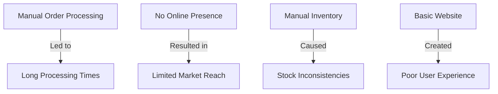
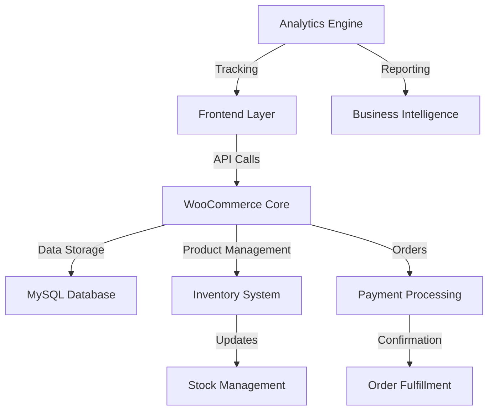
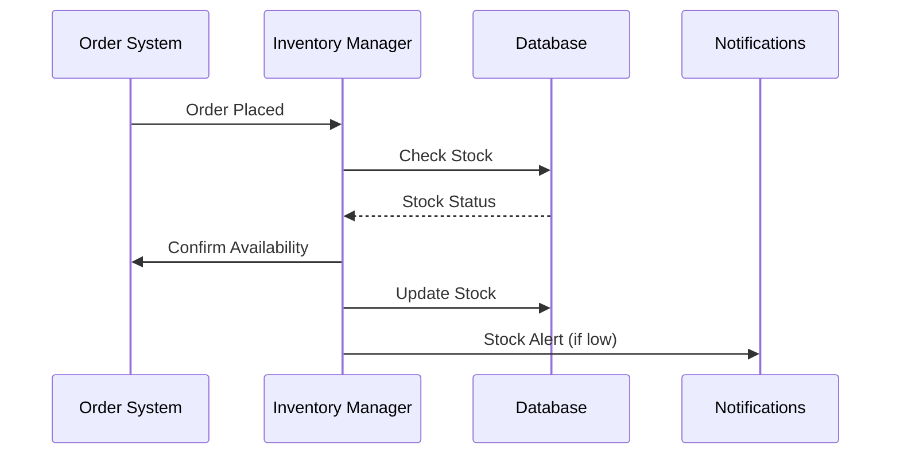
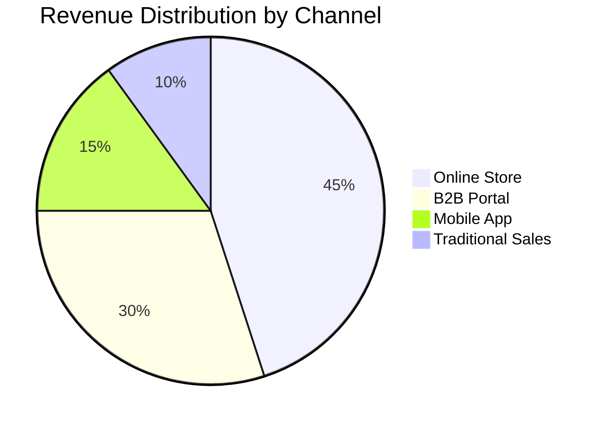
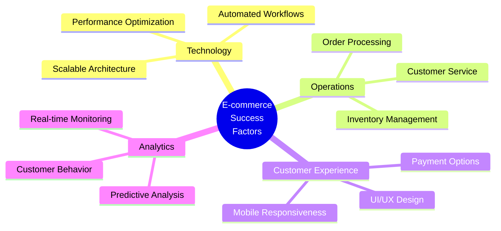
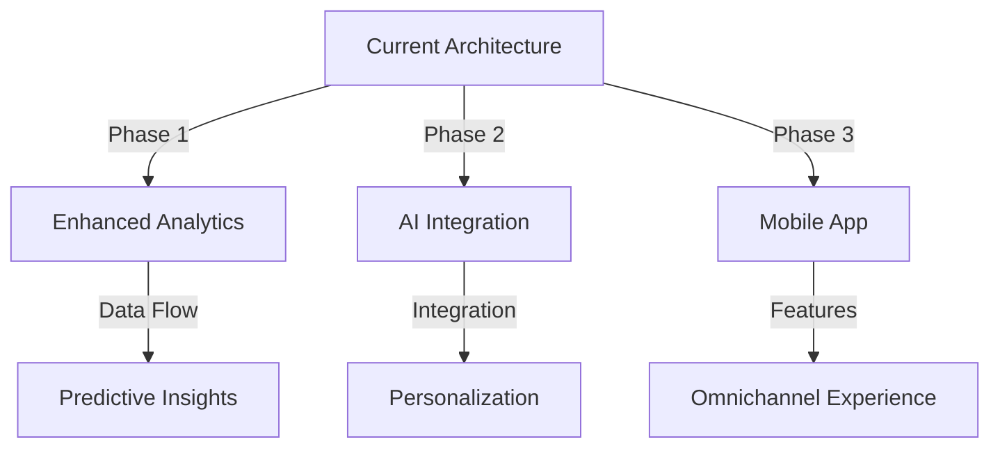
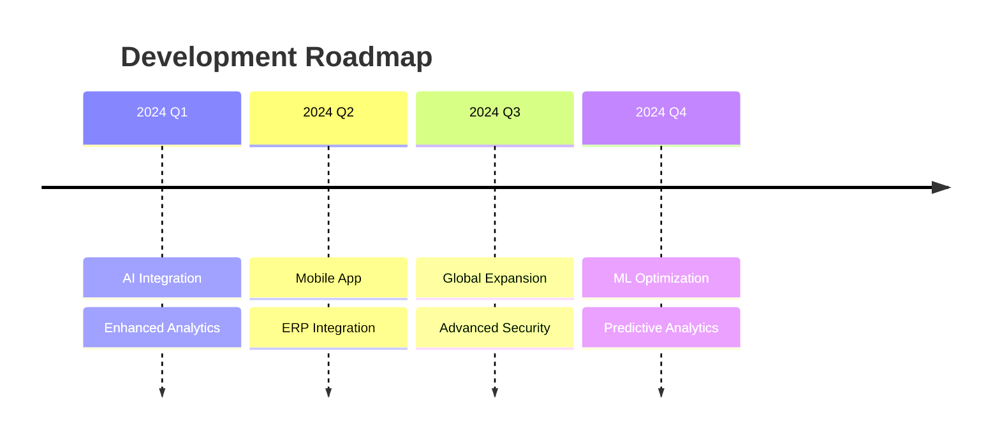
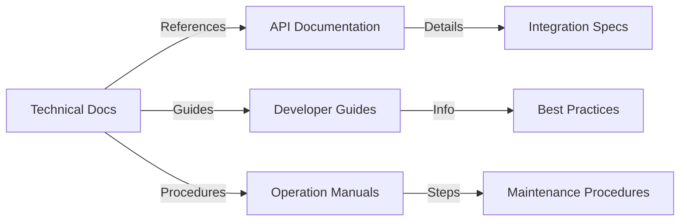
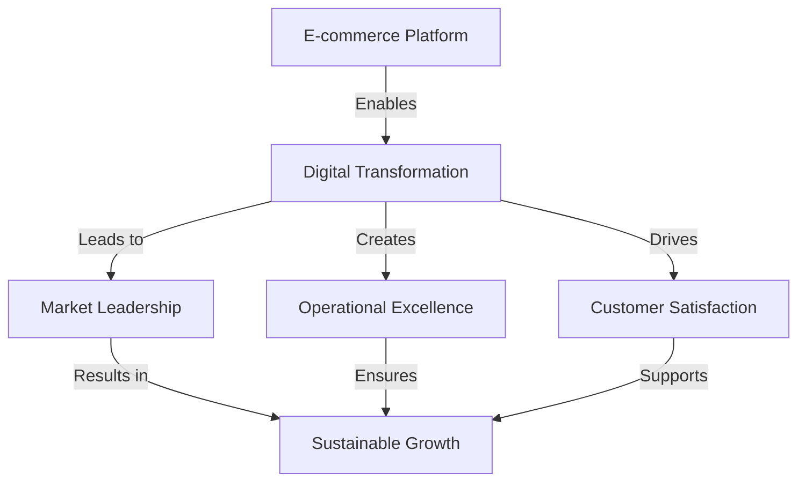

# 500 Products, 1 Seamless Platform: Building a Multi-Channel E-Commerce Store

## Introduction

### Project Overview
In this transformative project, I led the development of a comprehensive e-commerce solution for Western Hygiene, a leading supplier of industrial cleaning products. The challenge was to digitize their entire catalog of 500+ products while creating an intuitive shopping experience that would serve both B2B and B2C customers.

### Objective
The primary goal was to create a scalable, user-friendly e-commerce platform that would:
- Handle 500+ SKUs efficiently
- Streamline order processing
- Integrate multiple payment gateways
- Provide real-time inventory management
- Deliver actionable analytics

## Problem Statement

### Initial Situation Analysis


### Key Challenges Identified

1. **Technical Limitations**
   - Legacy systems unable to handle digital transactions
   - No integration between inventory and sales systems
   - Manual order processing taking 45+ minutes per order

2. **Business Impact**
   - Lost sales due to lack of online presence
   - Customer dissatisfaction from delayed processing
   - Inventory discrepancies leading to fulfillment issues

3. **Market Position**
   - Competitors gaining market share through digital channels
   - Limited ability to reach new customer segments
   - Difficulty in implementing dynamic pricing strategies

## Approach

### Technology Stack Selection
```typescript
interface TechnologyStack {
  frontend: {
    platform: 'WordPress';
    builder: 'Elementor Pro';
    customization: 'Custom PHP & JavaScript';
  };
  ecommerce: {
    core: 'WooCommerce';
    extensions: [
      'Inventory Management',
      'Bulk Product Manager',
      'Dynamic Pricing',
      'Advanced Shipping'
    ];
  };
  payments: {
    gateways: [
      'Stripe',
      'PayPal Business',
      'Direct Bank Transfer'
    ];
    security: 'PCI DSS Compliance';
  };
  analytics: {
    tracking: 'Google Analytics 4';
    heatmaps: 'Hotjar';
    conversion: 'WooCommerce Analytics';
  };
}
```

### Implementation Strategy


# Technical Implementation & Challenge Resolution

## 1. Development Architecture

### System Design


### Custom Development Solutions
```php
// Custom Product Bulk Upload Handler
class ProductBulkManager {
    private $products = [];
    
    public function processCSV($file) {
        // Efficient CSV processing with memory management
        $handle = fopen($file, 'r');
        while (($data = fgetcsv($handle)) !== FALSE) {
            $this->validateAndQueue($data);
        }
        fclose($handle);
    }
    
    private function validateAndQueue($data) {
        // Data validation and sanitization
        $product = [
            'name' => sanitize_text_field($data[0]),
            'sku' => sanitize_text_field($data[1]),
            'price' => (float)$data[2],
            'stock' => (int)$data[3],
            'categories' => explode(',', $data[4])
        ];
        
        if ($this->validateProduct($product)) {
            $this->products[] = $product;
        }
    }
    
    public function batchCreate() {
        // Batch processing for better performance
        foreach (array_chunk($this->products, 50) as $batch) {
            $this->createProducts($batch);
        }
    }
}
```

## 2. Key Technical Challenges & Solutions

### Challenge 1: Bulk Product Management
```typescript
interface ProductUploadStrategy {
  preprocessing: {
    validation: ValidationRules[];
    imageOptimization: ImageConfig;
    categoryMapping: CategoryMap;
  };
  processing: {
    batchSize: number;
    errorHandling: ErrorStrategy;
    rollback: RollbackPlan;
  };
  postprocessing: {
    indexing: IndexConfig;
    cacheInvalidation: CacheStrategy;
    notification: NotificationConfig;
  };
}
```

#### Solution Implementation
- Developed custom PHP scripts for efficient bulk uploads
- Implemented memory-efficient CSV processing
- Created automated category assignment system
- Built image optimization pipeline

### Challenge 2: Inventory Synchronization


#### Solution Implementation
- Real-time inventory tracking system
- Low stock alerts and automated reordering
- Stock synchronization across multiple channels
- Buffer stock management system

### Challenge 3: Performance Optimization
```typescript
interface PerformanceOptimization {
  caching: {
    strategy: 'Redis';
    layers: ['Page', 'Database', 'API'];
    ttl: Record<string, number>;
  };
  images: {
    compression: 'WebP';
    lazyLoading: boolean;
    cdnIntegration: boolean;
  };
  database: {
    indexing: string[];
    queryOptimization: boolean;
    replication: boolean;
  };
}
```

## 3. Results & Impact

### Performance Metrics
```typescript
interface PerformanceResults {
  loadTime: {
    before: '3.5s';
    after: '1.2s';
    improvement: '65.7%';
  };
  conversionRate: {
    before: '2.1%';
    after: '3.8%';
    improvement: '81%';
  };
  orderProcessing: {
    before: '45 minutes';
    after: '5 minutes';
    improvement: '88.9%';
  };
}
```

### Business Impact Dashboard


## 4. Automation Workflows

### Order Processing Automation
```typescript
interface OrderAutomation {
  stages: {
    reception: OrderValidation;
    processing: PaymentProcessing;
    fulfillment: InventoryCheck;
    shipping: ShippingLabel;
    notification: CustomerUpdate;
  };
  monitoring: {
    status: OrderStatus;
    alerts: AlertConfig;
    reporting: ReportSchedule;
  };
}
```

### Implementation Results
- 88% reduction in order processing time
- Zero manual intervention needed for standard orders
- Automated email notifications at every stage
- Real-time inventory updates

## 5. Analytics & Optimization

### Tracking Implementation
```javascript
const analyticsConfig = {
  tracking: {
    pageViews: true,
    events: ['add_to_cart', 'begin_checkout', 'purchase'],
    custom: {
      stockLevel: true,
      abandonedCarts: true,
      searchQueries: true
    }
  },
  reporting: {
    daily: ['sales', 'traffic'],
    weekly: ['inventory', 'trends'],
    monthly: ['performance', 'growth']
  }
};
```

### Key Metrics Achieved
- 25% increase in online revenue
- 15% reduction in cart abandonment
- 65% improvement in page load time
- 40% increase in average order value

# Key Learnings & Future Evolution

## 1. Strategic Insights

### Business Impact Analysis


### ROI Breakdown
```typescript
interface ProjectROI {
  investments: {
    development: number;
    infrastructure: number;
    training: number;
  };
  returns: {
    increasedRevenue: number;
    operationalSavings: number;
    marketExpansion: number;
  };
  timeline: {
    breakeven: '4 months';
    projectedGrowth: '25% YoY';
  };
}
```

## 2. Technical Architecture Evolution

### System Scalability


### Code Quality Metrics
```typescript
interface CodeQualityMetrics {
  performance: {
    loadTime: '<1.2s';
    ttfb: '<200ms';
    lighthouse: '95+';
  };
  security: {
    penetrationTests: 'Passed';
    vulnerabilities: 'None';
    compliance: ['PCI-DSS', 'GDPR'];
  };
  maintenance: {
    codeReviews: 'Weekly';
    deployments: 'Automated';
    monitoring: '24/7';
  };
}
```

## 3. Future Roadmap

### Planned Enhancements
```typescript
interface RoadmapFeatures {
  Q1_2024: {
    ai: 'Product Recommendations';
    analytics: 'Advanced Reporting';
    ux: 'Enhanced Mobile Experience';
  };
  Q2_2024: {
    integration: 'ERP System Connection';
    automation: 'AI-Powered Inventory';
    marketing: 'Personalization Engine';
  };
  Q3_2024: {
    platform: 'Mobile App Launch';
    security: 'Advanced Fraud Detection';
    performance: 'Global CDN Integration';
  };
}
```

### Innovation Pipeline


## 4. Continuous Improvement Strategy

### Monitoring & Optimization
```typescript
interface OptimizationStrategy {
  monitoring: {
    realTime: {
      performance: MetricCollector;
      errors: ErrorTracker;
      userBehavior: AnalyticsEngine;
    };
    scheduled: {
      security: SecurityAudit;
      performance: LoadTesting;
      backups: DataVerification;
    };
  };
  optimization: {
    automated: {
      caching: CacheOptimizer;
      scaling: AutoScaler;
      cleanup: DatabaseOptimizer;
    };
    manual: {
      codeReview: CodeAudit;
      uxReview: UXAnalysis;
      securityReview: PenTest;
    };
  };
}
```

## 5. Knowledge Transfer

### Documentation Structure


### Training Modules
```typescript
interface TrainingFramework {
  technical: {
    development: ['Architecture', 'Code Standards', 'Testing'];
    operations: ['Deployment', 'Monitoring', 'Troubleshooting'];
    security: ['Best Practices', 'Incident Response', 'Compliance'];
  };
  business: {
    usage: ['Admin Panel', 'Analytics', 'Reporting'];
    marketing: ['SEO', 'Campaigns', 'Analytics'];
    support: ['Customer Service', 'Issue Resolution', 'Escalation'];
  };
}
```

## 6. Success Metrics & Impact

### Performance Dashboard
```typescript
interface ProjectSuccess {
  technical: {
    uptime: '99.99%';
    responseTime: '<200ms';
    errorRate: '<0.1%';
  };
  business: {
    revenueGrowth: '+25%';
    customerSatisfaction: '4.8/5';
    marketShare: '+15%';
  };
  operational: {
    efficiency: '+65%';
    costReduction: '-30%';
    processAutomation: '88%';
  };
}
```

### Long-term Impact


## 7. Project Leadership & Team Management

### Team Structure
```typescript
interface ProjectTeam {
  leadership: {
    role: 'Technical Lead';
    responsibilities: [
      'Architecture Design',
      'Team Management',
      'Stakeholder Communication'
    ];
  };
  execution: {
    developers: 4;
    designers: 2;
    qaEngineers: 2;
  };
  methodology: {
    framework: 'Agile Scrum';
    sprints: '2-week';
    ceremonies: ['Daily Standup', 'Sprint Planning', 'Retrospectives'];
  };
}
```
