# Building a Multi-Channel E-Commerce Store: 500 Products, 1 Seamless Platform


### Table of Contents
1. [Project Overview](#1-project-overview)
2. [Problem Statement](#2-problem-statement)
3. [Tech Aprroach](#3-approach)
4. [Challenge 1: Bulk Product Management](#4-challenge-1-bulk-product-management--large-product-catalogs)
5. [Challenge 2: Inventory Synchronization & Automated SO Order Generation](#5-challenge-2-inventory-synchronization--automated-so-order-generation)
6. [Challenge 3: Performance Optimization](#6-challenge-3-performance-optimization)
7. [Implentation Of Google Analytics 4](#7-implentation-of-google-analytics-4)
8. [Strategic And Business Insights](#8-strategic-and-business-insights)

<br>
<br>
<br>
<br>

## 1. Project Overview

In this transformative project, I led the development of a comprehensive e-commerce solution for Western Hygiene, a leading supplier of industrial cleaning products. The challenge was to digitize their entire catalog of 500+ products while creating an intuitive shopping experience that would serve both B2B and B2C customers.

### Objective
The primary goal was to create a scalable, user-friendly e-commerce platform that would:
- Handle 500+ SKUs efficiently
- Streamline order processing
- Integrate multiple payment gateways
- Provide real-time inventory management
- Deliver actionable analytics

<br>
<br>
<br>
<br>


## 2. Problem Statement

### Initial Situation Analysis


### Key Challenges Identified

1. **Technical Limitations**
   - Legacy systems unable to handle digital transactions
   - No integration between inventory and sales systems
   - Manual order processing taking 45+ minutes per order

2. **Business Impact**
   - Lost sales due to lack of online presence
   - Customer dissatisfaction from delayed processing
   - Inventory discrepancies leading to fulfillment issues

3. **Market Position**
   - Competitors gaining market share through digital channels
   - Limited ability to reach new customer segments
   - Difficulty in implementing dynamic pricing strategies

<br>
<br>
<br>
<br>


## 3. Approach

### Technology Stack Selection
```
📦 Technology Stack
 ┣ 📂 Frontend
 ┃ ┣ 📱 WordPress Platform
 ┃ ┣ 🎨 Elementor Pro Builder
 ┃ ┗ 💻 Custom PHP & JavaScript
 ┃
 ┣ 📂 E-commerce (WooCommerce)
 ┃ ┣ 📦 Inventory Management
 ┃ ┣ 📋 Bulk Product Manager
 ┃ ┣ 💰 Dynamic Pricing
 ┃ ┗ 🚚 Advanced Shipping
 ┃
 ┣ 📂 Payments
 ┃ ┣ 💳 Stripe
 ┃ ┣ 💰 PayPal Business
 ┃ ┣ 🏦 Direct Bank Transfer
 ┃ ┗ 🔒 PCI DSS Compliance
 ┃
 ┗ 📂 Analytics
   ┣ 📊 Google Analytics 4
   ┗ 📈 WooCommerce Analytics
```

### Implementation Strategy


<br>
<br>
<br>
<br>


## 4. Challenge 1: Bulk Product Management- Large Product Catalogs

#### Key Challenges:

- Managing 500+ products with frequent price/stock updates
- Memory crashes during large file uploads
- Data inconsistencies from manual entry

#### Solution:

In scaling our e-commerce platform, I designed and implemented a robust product upload system with a strong focus on performance and reliability. Let me break down what I built:
Before uploading any product, the system:

1. ***I built a smart CSV processing system that could:***

- Handle large files without memory issues
- Validate product data before import
- Process products in efficient batches of 50
- Sanitize inputs for security
- Maintain data integrity

2. ***During the upload:***

- Processes products in efficient batches to prevent server overload
- Has error handling to catch and log any issues
- Includes a rollback feature using Hostinger's backup system - if something goes wrong, we can restore to a working state

3. ***After upload completes:***

- Updates search indexes for quick product discovery
- Clears LiteSpeed cache to ensure customers see the latest products
- Sends notifications to relevant team members


#### Result
The impact? We now handle bulk uploads of 500+ products smoothly, with zero downtime and 99.9% success rate. Page load times stayed under 2 seconds even with our growing catalog, and we've eliminated manual intervention in the upload process.
This showcases my ability to architect end-to-end solutions while leveraging existing tools (Hostinger, LiteSpeed) to maximize performance without reinventing the wheel.


<br>
<br>
<br>
<br>


## 5. Challenge 2: Inventory Synchronization & Automated SO Order Generation

Let me share an exciting integration project I led that bridged our e-commerce and ERP systems. The challenge? Our team was manually creating sales orders in the ERP system for each WooCommerce order, leading to delays and occasional errors.

#### Key Challenges:

1. Multiple systems (WooCommerce & ERP) operating in silos
2. Manual SO creation taking 15 minutes per order
3. Inventory discrepancies causing overselling
4. Communication delays between teams
5. Data synchronization errors
6. Different data formats between systems


#### Solution: 
I spearheaded the development of a custom API solution that automatically generates Sales Order (SO) numbers in our ERP the moment a WooCommerce order is placed,syncs inventory levels in real-time between systems, sends automated alerts for low stock levels and maintains consistent stock levels across all sales channels.

#### Result & Impact

- Reduced order processing time from 15 mins to <30 seconds (98% improvement)
- Eliminated manual data entry errors (previously 5-8% error rate)
- Achieved 99.9% inventory accuracy (up from 85%)
- Saved 30+ hours per week in manual work
- Reduced customer complaints about stock issues by 95%
- Improved order fulfillment rate to 99.5%

<br>
<br>
<br>
<br>


## 6. Challenge 3: Performance Optimization

#### Key Challenges:
- Page load times exceeding 5 seconds
- High server response times during peak traffic
- Cart abandonment due to slow performance
- Poor mobile user experience

#### Solution:
I implemented a comprehensive optimization strategy:

- Multi-layer caching using Redis for pages, database queries, and API responses
- Image optimization with WebP conversion and lazy loading
- CDN integration for global content delivery
- Database optimization through indexing and query refinement
- Implemented database replication for read/write splitting
- Server-side caching for frequently accessed data

#### Results & Impact:

- Reduced page load time from 5s to <2s (60% improvement)
- Decreased server response time by 75%
- Cut bandwidth usage by 40% through image optimization
- Improved mobile page speed score from 65 to 92
- Reduced cart abandonment rate by 25%

```mermaid
graph LR
    subgraph Before
    A[Load Time: 3.5s]
    B[Conversion: 2.1%]
    C[Processing: 45m]
    end
    
    subgraph After
    D[Load Time: 1.2s]
    E[Conversion: 3.8%]
    F[Processing: 5m]
    end
    
    A -->|65.7% ⬇️| D
    B -->|81% ⬆️| E
    C -->|88.9% ⬇️| F
```




<br>
<br>
<br>
<br>


## 7. Implentation Of Google Analytics 4

### Tracking Implementation

I implemented a comprehensive analytics strategy using GA4 and GTM to transform our e-commerce data into actionable insights.

#### Solution:

I set up advanced tracking that monitors:
- Critical user events (add to cart, checkout, purchases)
- Abandoned cart analysis
- Search behavior patterns
- Custom reporting automation for daily sales, weekly trends, and monthly growth

  ```mermaid
  graph TD
    A[Google Tag Manager] -->|Events| B[Google Analytics 4]
    B -->|Real-time| C[Daily Reports]
    B -->|Analysis| D[Weekly Insights]
    B -->|Trends| E[Monthly Growth]
    
    C -->|Track| F[Sales & Traffic]
    D -->|Monitor| G[Inventory & Trends]
    E -->|Analyze| H[Performance & Growth]
    ```

<br>
<br>
<br>
<br>

## 8. Strategic And Business Insights

### Business Impact Analysis


#### Solution:
I created an integrated dashboard system that:

- Centralizes data from multiple sources (GA4)
- Automates weekly/monthly reporting
- Provides real-time monitoring of key metrics
- Tracks custom KPIs and business goals

#### Results & Impact:

- Reduced reporting time from 15 hours to 1 hour weekly
- Enabled real-time decision making for all stakeholders
- Increased marketing ROI by 40% with data-driven campaigns

<br>
<br>
<br>
<br>
