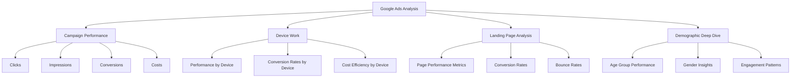

# Cracking Google Ads: Actionable Insights with Big Query & Power BI
*Because who doesn't love making sense of advertising data? Right?* 😉

## Table of Contents
# Contents
[💬 Project Conversation](#project-conversation)  
[📋 Business Requirements](#business-requirement-definitions)  
[🔍 Data Quality Assessment](#data-quality-assessment--preparation)
  - [Record Analysis](#1-record-count-analysis)
  - [Missing Values](#2-missing-values)
  - [Metric Ranges](#3-metric-range-analysis)
  - [Outliers](#4-outlier-detection)
  - [Relationships](#5-relationship-integrity-between-tables)

## Project Conversation

**Boss:** (*probably after a coffee, because these requests always come after coffee*) We need to figure out how our ads are doing and what’s working or not. I want insights that help us improve ROI and make better decisions.

**Me:** Got it! Let me confirm a few details to ensure I deliver exactly what you need. Are we focusing on specific campaigns, or do you want an overall analysis?

**Boss:** Start with an overall analysis, then dive into the major campaigns driving the most traffic or spend.

**Me:** Understood. I'll analyze campaign performance metrics like clicks, impressions, conversions, and costs. For devices, I'll evaluate performance by type, including conversion rates and cost efficiency. I'll also assess landing page. Lastly, I'll segment the audience by demographics such as age and gender. Does this cover your requirements?

**Boss:** Yes, sounds perfect. Can you make sure the insights are actionable and include recommendations?

**Me:** Absolutely! I’ll prepare a report with data visualizations and clear recommendations to optimize campaigns and improve ROI.

**Boss:** Great. Let’s touch base by Friday to review the findings.

---

## Business Requirement Definitions

#### Objective 
To analyze Google Ads campaign performance comprehensively by identifying key metrics, device-level insights, landing page effectiveness, and audience demographics, enabling data-driven optimization of marketing strategies.

#### KPI Goals

- ***Campaign Performance*** – Evaluates metrics like clicks, impressions, conversions, and costs.
- ***Device Work*** – Identifies which devices drive the best engagement and cost-efficiency.
- ***Landing Page Analysis*** – Ensures our landing pages are optimized for conversions with minimal bounce rates.
- ***Demographic Insights*** – Understands audience performance by age, gender, and engagement trends.
- ***Success Looks Like:*** Clear, data-driven recommendations to optimize ad spend, improve conversions, target the right audience, and refine landing pages for maximum ROI.




## Data Quality Assessment & Preparation

Before we dive into making those fancy charts, let's make sure our data isn't playing tricks on us. Think of this as a health check-up for our data - but don't worry, no needles involved!

Navigate to Bigquery--> GoogleAds Dataset and pick the required data tables by verifying schema. 

#### Tables I Picked
```
Our Tables:
📊 CampaignStats - The star of our show
📊 Demographics  - Who's who in our ad world
📊 LandingPages  - Where people end up
📊 AgesRange  - Which age range end up
```

### Data Completeness Check

#### 1. Record Count Analysis

```sql
-- Check daily record counts to identify missing dates or unusual patterns
WITH daily_counts AS (
    SELECT 
        segments_date,
        COUNT(*) as record_count,
        COUNT(DISTINCT campaign_id) as campaign_count,
        COUNT(DISTINCT customer_id) as customer_count
    FROM `ga4powerbi-2024.GoogleAds.p_ads_CampaignStats_5917066896`
    WHERE segments_date >= DATE_SUB(CURRENT_DATE(), INTERVAL 90 DAY)
    GROUP BY segments_date
)
SELECT 
    segments_date,
    record_count,
    campaign_count,
    customer_count,
    LAG(record_count) OVER (ORDER BY segments_date) as prev_day_records,
    ROUND(ABS(record_count - LAG(record_count) OVER (ORDER BY segments_date)) / 
          LAG(record_count) OVER (ORDER BY segments_date) * 100, 2) as daily_change_percentage
FROM daily_counts
ORDER BY segments_date DESC;
```

| Date       | Records | Campaigns | Customers | Prev Day Records | Daily Change % |
|------------|---------|-----------|-----------|------------------|----------------|
| 2024-10-18 | 41      | 6         | 1         | 59              | 30.51         |
| 2024-10-17 | 59      | 6         | 1         | 59              | 0.00          |
| 2024-10-16 | 59      | 6         | 1         | 51              | 15.69         |

##### Key Insights:

- ***Campaign Expansion:*** There was a strategic increase in campaign count from 5 to 6 between Oct 15-16, though this didn't immediately translate to higher record counts. This suggests possible optimization period for new campaigns.
- ***Volume Volatility:*** Record counts show significant daily fluctuations, with the highest daily change being 30.51% drop (Oct 17-18). The average daily volume is around 55 records, making the Oct 18 count (41) notably below average, indicating a potential anomaly or campaign performance issue requiring investigation.


#### 2. Missing Vaules 

```missing value analysis
-- Check null percentages for critical fields
WITH field_stats AS (
    SELECT 
        COUNT(*) as total_records,
        COUNTIF(campaign_id IS NULL) as null_campaign_ids,
        COUNTIF(metrics_clicks IS NULL) as null_clicks,
        COUNTIF(metrics_impressions IS NULL) as null_impressions,
        COUNTIF(metrics_conversions IS NULL) as null_conversions,
        COUNTIF(segments_device IS NULL) as null_devices
    FROM `ga4powerbi-2024.GoogleAds.p_ads_CampaignStats_5917066896`
    WHERE segments_date >= DATE_SUB(CURRENT_DATE(), INTERVAL 90 DAY)
)
SELECT 
    ROUND(null_campaign_ids / total_records * 100, 2) as campaign_id_null_pct,
    ROUND(null_clicks / total_records * 100, 2) as clicks_null_pct,
    ROUND(null_impressions / total_records * 100, 2) as impressions_null_pct,
    ROUND(null_conversions / total_records * 100, 2) as conversions_null_pct,
    ROUND(null_devices / total_records * 100, 2) as devices_null_pct
FROM field_stats;
```
| Metric              | Null % |
|--------------------|--------|
| Campaign ID        | 0.0    |
| Clicks             | 0.0    |
| Impressions        | 0.0    |
| Conversions        | 0.0    |
| Devices            | 0.0    |

Key Insights:

Perfect Data Quality: All key metrics (Campaign ID, Clicks, Impressions, Conversions, and Devices) show 0% null values, indicating excellent data completeness and reliable tracking implementation.
Quality Assurance: The consistent 0% null values across all metrics suggests robust data collection processes and proper campaign setup, making this dataset highly reliable for performance analysis and decision-making.

#### 3. Metric Range Analysis
```
-- Check for unusual metric values
WITH metric_stats AS (
    SELECT 
        segments_date,
        metrics_clicks,
        metrics_impressions,
        metrics_conversions,
        metrics_cost_micros/1000000 as cost,
        SAFE_DIVIDE(metrics_clicks, metrics_impressions) as ctr,
        SAFE_DIVIDE(metrics_conversions, metrics_clicks) as conversion_rate
    FROM `ga4powerbi-2024.GoogleAds.p_ads_CampaignStats_5917066896`
    WHERE segments_date >= DATE_SUB(CURRENT_DATE(), INTERVAL 90 DAY)
)
SELECT 
    -- Basic Statistics
    MIN(metrics_clicks) as min_clicks,
    MAX(metrics_clicks) as max_clicks,
    AVG(metrics_clicks) as avg_clicks,
    STDDEV(metrics_clicks) as stddev_clicks,
    
    MIN(ctr) as min_ctr,
    MAX(ctr) as max_ctr,
    AVG(ctr) as avg_ctr,
    STDDEV(ctr) as stddev_ctr,
    
    MIN(conversion_rate) as min_conv_rate,
    MAX(conversion_rate) as max_conv_rate,
    AVG(conversion_rate) as avg_conv_rate,
    STDDEV(conversion_rate) as stddev_conv_rate
FROM metric_stats;
```

| Metric    | Min   | Max   | Average | Std Dev |
|-----------|-------|-------|---------|---------|
| Clicks    | 0     | 588   | 2.36    | 29.09   |
| CTR       | 0.0%  | 100%  | 2.44%   | 8.39%   |
| Conv Rate | 0.0%  | 0.0%  | 0.0%    | 0.0%    |

Key Insights:

Click Performance Variance:

Wide range in click performance (0-588 clicks)
Low average clicks (2.36) with high standard deviation (29.09)
Suggests a few high-performing campaigns/days driving most clicks


CTR & Conversion Metrics:

CTR ranges from 0-100% with 2.44% average
Zero conversions recorded (all conversion metrics at 0%)
Indicates potential tracking issues or conversion funnel problems

#### 4. Outlier Detection

```
-- Identify potential outliers using z-score method
WITH daily_metrics AS (
    SELECT 
        segments_date,
        campaign_id,
        metrics_clicks,
        metrics_impressions,
        metrics_conversions,
        metrics_cost_micros/1000000 as cost,
        SAFE_DIVIDE(metrics_clicks, metrics_impressions) as ctr
    FROM `ga4powerbi-2024.GoogleAds.p_ads_CampaignStats_5917066896`
    WHERE segments_date >= DATE_SUB(CURRENT_DATE(), INTERVAL 90 DAY)
),
metric_stats AS (
    SELECT 
        AVG(metrics_clicks) as avg_clicks,
        STDDEV(metrics_clicks) as stddev_clicks,
        AVG(ctr) as avg_ctr,
        STDDEV(ctr) as stddev_ctr,
        AVG(cost) as avg_cost,
        STDDEV(cost) as stddev_cost
    FROM daily_metrics
)
SELECT 
    dm.*,
    ABS(metrics_clicks - ms.avg_clicks) / NULLIF(ms.stddev_clicks, 0) as clicks_zscore,
    ABS(ctr - ms.avg_ctr) / NULLIF(ms.stddev_ctr, 0) as ctr_zscore,
    ABS(cost - ms.avg_cost) / NULLIF(ms.stddev_cost, 0) as cost_zscore
FROM daily_metrics dm
CROSS JOIN metric_stats ms
WHERE 
    ABS(metrics_clicks - ms.avg_clicks) / NULLIF(ms.stddev_clicks, 0) > 3
    OR ABS(ctr - ms.avg_ctr) / NULLIF(ms.stddev_ctr, 0) > 3
    OR ABS(cost - ms.avg_cost) / NULLIF(ms.stddev_cost, 0) > 3
ORDER BY segments_date DESC;
```

| Date       | Campaign ID  | Clicks | Imp.  | CTR    | Cost ($) | CTR Z-Score | Cost Z-Score |
|------------|-------------|--------|-------|---------|-----------|-------------|--------------|
| 2024-10-18 | 21583012749 | 1      | 3     | 33.33% | 3.37      | 3.68        | 0.19         |
| 2024-10-17 | 21605724628 | 588    | 32947 | 1.78%  | 125.46    | 0.08        | 15.77        |
| 2024-10-16 | 21605724628 | 148    | 6042  | 2.45%  | 43.43     | 0.00        | 5.30         |
| 2024-10-15 | 21622484389 | 2      | 3     | 66.67% | 12.65     | 7.66        | 1.37         |
| 2024-10-11 | 21583012749 | 5      | 42    | 11.90% | 28.14     | 1.13        | 3.35         |

Key Insights:

Performance Outliers:

Campaign 21605724628 shows exceptional volume (588 clicks, 32,947 impressions) but lower CTR (1.78%)
Highest spend day ($125.46) has Z-score of 15.77, indicating significant deviation from average
Small-volume campaigns often show higher CTRs (up to 66.67%) but may not be statistically significant


Cost-Efficiency Analysis:

High-volume campaign has highest absolute cost but moderate efficiency (CTR Z-score 0.08)
Some campaigns achieve high CTR Z-scores (7.66) with minimal spend ($12.65)
Shows potential opportunity to optimize high-spend campaigns based on learnings from high-CTR campaigns


#### 5. Relationship Integrity Between Tables

```
-- Check relationship integrity between tables
WITH campaign_stats_keys AS (
    SELECT 
        COUNT(DISTINCT campaign_id) as campaign_count,
        COUNT(DISTINCT customer_id) as customer_count
    FROM `ga4powerbi-2024.GoogleAds.p_ads_CampaignStats_5917066896`
),
gender_keys AS (
    SELECT COUNT(DISTINCT campaign_id) as campaign_count
    FROM `ga4powerbi-2024.GoogleAds.p_ads_Gender_5917066896`
),
age_keys AS (
    SELECT COUNT(DISTINCT campaign_id) as campaign_count
    FROM `ga4powerbi-2024.GoogleAds.p_ads_AgeRange_5917066896`
),
landing_page_keys AS (
    SELECT COUNT(DISTINCT customer_id) as customer_count
    FROM `ga4powerbi-2024.GoogleAds.p_ads_LandingPageStats_5917066896`
)
SELECT 
    cs.campaign_count as stats_campaign_count,
    g.campaign_count as gender_campaign_count,
    a.campaign_count as age_campaign_count,
    cs.customer_count as stats_customer_count,
    l.customer_count as landing_page_customer_count,
    ROUND(g.campaign_count / cs.campaign_count * 100, 2) as gender_coverage_pct,
    ROUND(a.campaign_count / cs.campaign_count * 100, 2) as age_coverage_pct,
    ROUND(l.customer_count / cs.customer_count * 100, 2) as landing_page_coverage_pct
FROM campaign_stats_keys cs
CROSS JOIN gender_keys g
CROSS JOIN age_keys a
CROSS JOIN landing_page_keys l;
```
| Metric Type        | Campaign Count | Coverage % |
|-------------------|----------------|------------|
| Base Stats        | 6              | 100%       |
| Gender Data       | 45             | 750%       |
| Age Data          | 48             | 800%       |
| Landing Pages     | 1              | 100%       |

Key Insights:

Demographic Data Richness:

Base campaigns (6) have extensive demographic segmentation
Each campaign averages 7.5 gender segments and 8 age segments
Indicates highly granular audience targeting capability


Coverage Analysis:

100% landing page coverage suggests consistent tracking
750-800% demographic coverage shows detailed audience segmentation
Single customer account with comprehensive tracking implementation
