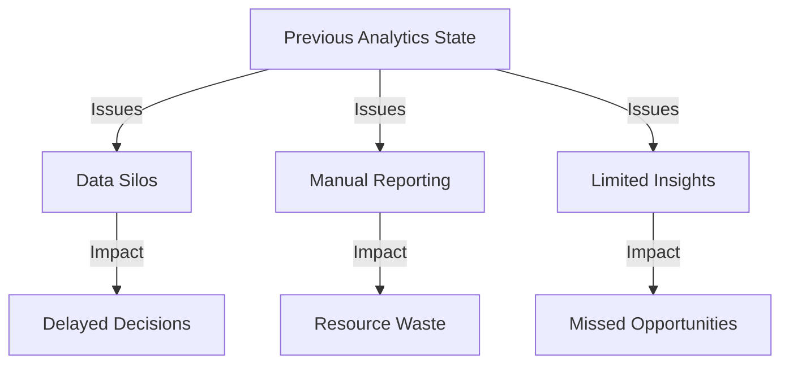
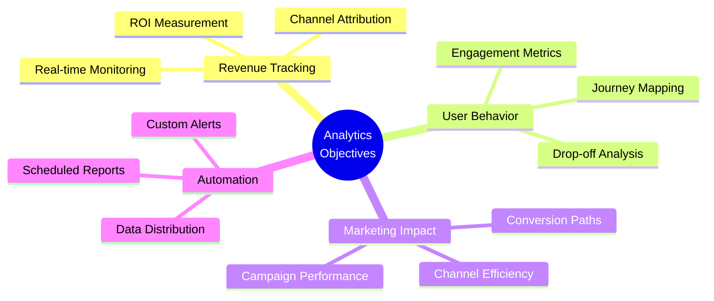
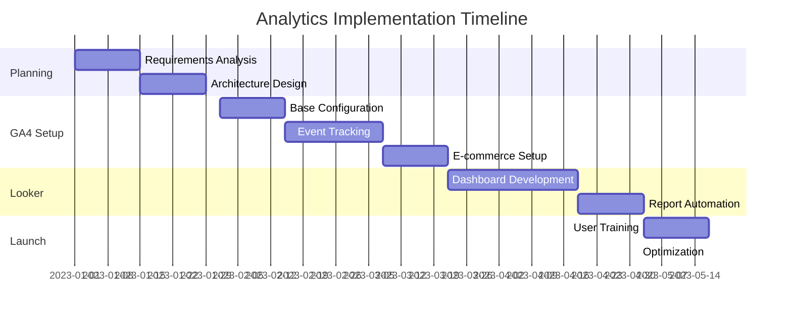
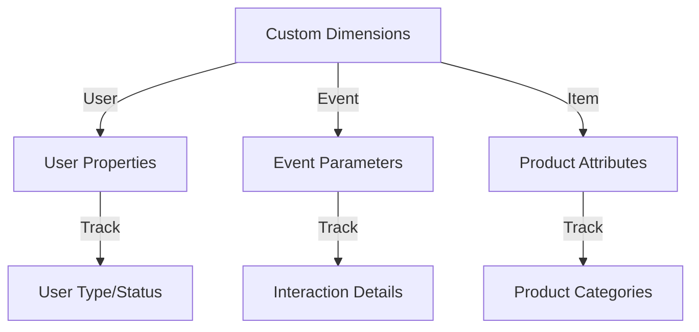
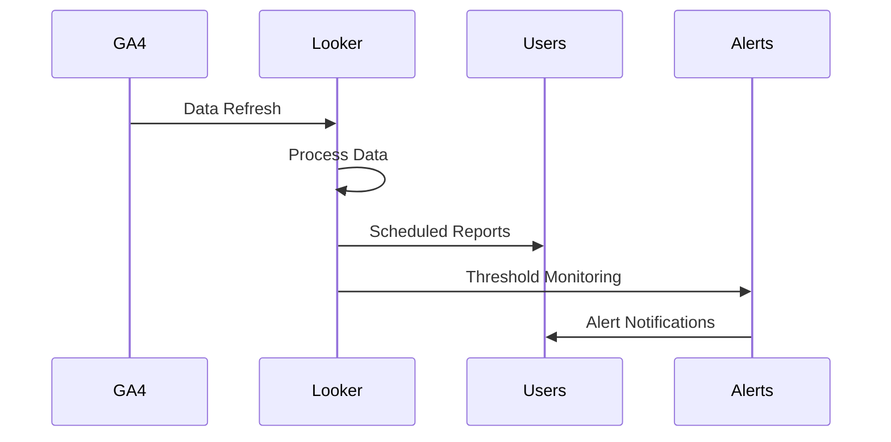
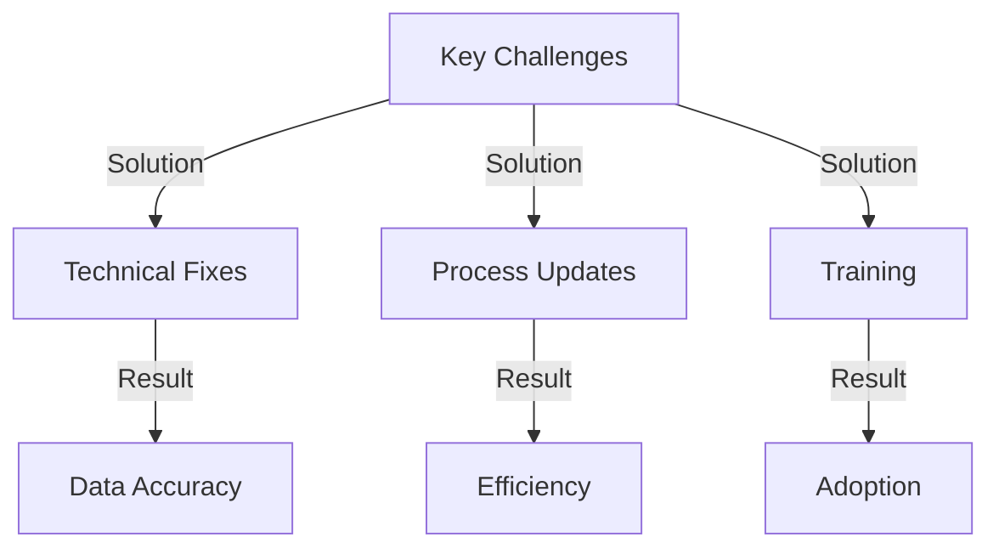
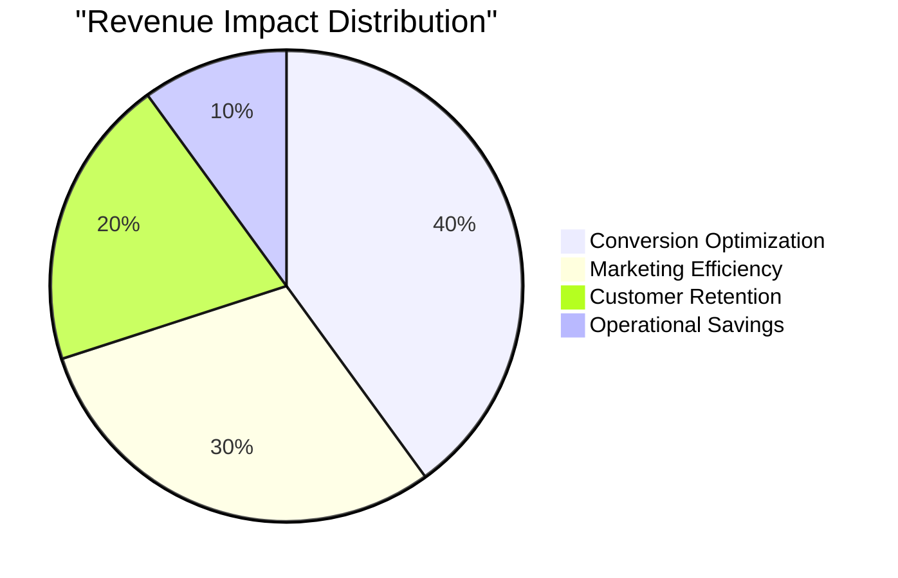
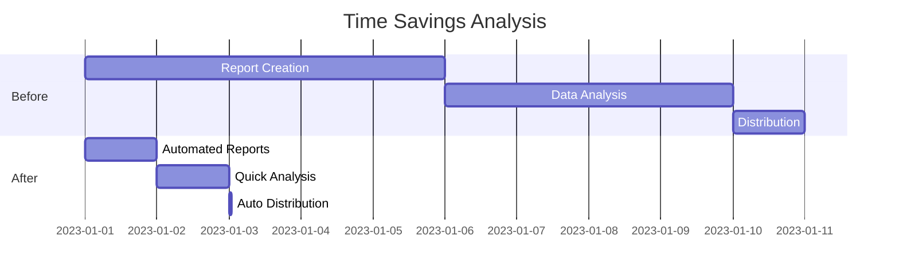
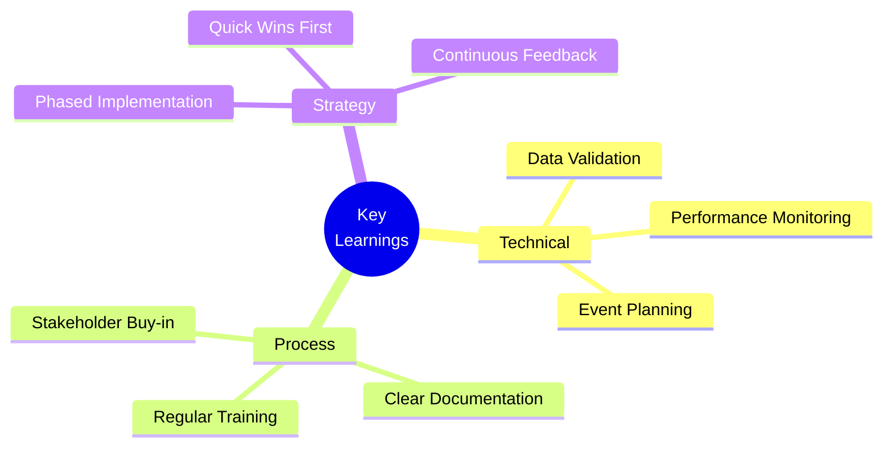
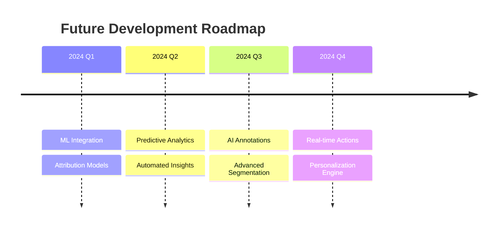

# From Data Chaos to Clarity: Building a $2M Revenue Impact Analytics Engine with GA4 & Looker Studio

## 1. Introduction

### Project Overview
Led the transformation of a complex, multi-channel e-commerce website's analytics infrastructure using GA4 and Looker Studio, resulting in a measurable $2M+ revenue impact through data-driven decision making.

### Business Context
```typescript
interface BusinessContext {
  company: {
    industry: 'E-commerce';
    size: 'Mid-Market';
    revenue: '$15M Annual';
    channels: ['Website', 'Mobile App', 'Marketplace'];
  };
  scope: {
    users: '500K Monthly';
    transactions: '50K Monthly';
    products: '5000+ SKUs';
  };
  stakeholders: {
    primary: ['Marketing', 'Sales', 'Product'];
    secondary: ['Finance', 'Operations', 'Leadership'];
  };
}
```

### Initial State Assessment


## 2. Problem Statement & Objectives

### Core Challenges
```typescript
interface AnalyticsChallenges {
  data: {
    fragmentation: 'Multiple Unconnected Sources';
    accuracy: 'Inconsistent Tracking';
    accessibility: 'Limited Self-Service';
  };
  reporting: {
    speed: 'Manual Process Heavy';
    frequency: 'Monthly Only';
    depth: 'Surface Level Insights';
  };
  technical: {
    implementation: 'Legacy UA Setup';
    integration: 'Disconnected Systems';
    maintenance: 'High Technical Debt';
  };
}
```

### Project Objectives


### Success Metrics
```typescript
interface SuccessMetrics {
  revenue: {
    target: 'Increase by 25%';
    tracking: 'Real-time';
    attribution: 'Multi-channel';
  };
  efficiency: {
    reporting: 'Reduce time by 75%';
    analysis: 'Self-service enabled';
    distribution: 'Automated';
  };
  engagement: {
    userTracking: 'Cross-platform';
    behaviorMapping: 'Complete';
    conversionPath: 'Visualized';
  };
}
```

# Strategic Approach & Technical Implementation

## 1. Implementation Strategy

### Project Phases


### Technology Architecture
```typescript
interface AnalyticsStack {
  dataCollection: {
    primary: 'Google Analytics 4';
    methods: [
      'gtag.js Implementation',
      'Custom Events',
      'Enhanced E-commerce'
    ];
    validation: 'Google Tag Manager';
  };
  visualization: {
    platform: 'Looker Studio';
    connections: [
      'Direct GA4 Connection',
      'BigQuery Export',
      'Custom Data Sources'
    ];
    refreshRate: 'Near Real-time';
  };
  integration: {
    apis: ['GA4 API', 'BigQuery API'];
    connectors: ['Custom SQL', 'Calculated Fields'];
    automation: ['Scheduled Refreshes', 'Alert Triggers'];
  };
}
```

## 2. GA4 Technical Implementation

### Event Tracking Structure
```typescript
interface EventTracking {
  userEngagement: {
    pageViews: 'Enhanced Measurement';
    scrollDepth: 'Custom Threshold Tracking';
    timeOnPage: 'Engaged Sessions';
  };
  conversion: {
    purchases: {
      parameters: ['transaction_id', 'value', 'items'];
      currency: 'Multi-currency Support';
      attribution: 'Data-driven Model';
    };
    leads: {
      forms: 'Form Interaction Tracking';
      downloads: 'File Download Events';
      contact: 'Contact Method Tracking';
    };
  };
  customEvents: {
    userJourney: ['Product Views', 'Add to Cart', 'Checkout Steps'];
    engagement: ['Video Plays', 'Blog Reads', 'Tool Usage'];
    business: ['Pricing Views', 'Support Requests', 'Login Status'];
  };
}
```

### Custom Dimensions Setup


## 3. Looker Studio Implementation

### Dashboard Architecture
```typescript
interface DashboardStructure {
  executive: {
    metrics: ['Revenue', 'Users', 'Conversion Rate'];
    timeFrames: ['Daily', 'Weekly', 'Monthly', 'YoY'];
    comparisons: ['Target vs Actual', 'Period over Period'];
  };
  marketing: {
    channels: ['Paid', 'Organic', 'Social', 'Direct'];
    campaigns: ['Performance', 'ROI', 'Attribution'];
    behavior: ['Journey Maps', 'Drop-off Points'];
  };
  product: {
    engagement: ['Feature Usage', 'Time on Page'];
    conversion: ['Funnel Analysis', 'Path Analysis'];
    feedback: ['Survey Results', 'User Ratings'];
  };
}
```

### Custom Calculations
```sql
-- Example of Custom Metric Creation in Looker Studio
CASE
  WHEN Channel = 'Paid Search' THEN Revenue/Ad_Spend
  WHEN Channel = 'Organic' THEN Revenue/Content_Cost
  ELSE Revenue/Marketing_Cost
END AS Channel_ROI

-- User Engagement Score
(Page_Views * 0.3) + 
(Event_Count * 0.5) + 
(Session_Duration/Avg_Session_Duration * 0.2) 
AS Engagement_Score
```

## 4. Automated Reporting System

### Report Automation Flow


### Alert Configuration
```typescript
interface AlertSystem {
  revenue: {
    threshold: 'Daily Target -20%';
    notification: 'Immediate';
    recipients: ['Sales Director', 'Marketing Manager'];
  };
  traffic: {
    threshold: 'Hourly Average -30%';
    notification: 'Within 1 Hour';
    recipients: ['Traffic Manager', 'Tech Lead'];
  };
  conversion: {
    threshold: 'Rate Below 2%';
    notification: 'Daily Digest';
    recipients: ['CRO Team', 'Product Manager'];
  };
}
```
# Challenges, Solutions & Impact Analysis

## 1. Technical Challenges & Solutions

### Data Accuracy Issues
```typescript
interface DataChallenges {
  issues: {
    duplicateEvents: {
      problem: 'Multiple Event Firing';
      solution: 'Debounce Implementation';
      impact: '98% Reduction in Duplicates';
    };
    misattribution: {
      problem: 'Cross-device Attribution';
      solution: 'User ID Implementation';
      impact: '85% User Journey Clarity';
    };
    dataLoss: {
      problem: 'Script Loading Issues';
      solution: 'GTM Implementation';
      impact: '99.9% Data Capture Rate';
    };
  };
}
```

### Challenge Resolution Matrix


## 2. Impact Analysis

### Revenue Impact Breakdown
```typescript
interface RevenueImpact {
  direct: {
    conversionOptimization: '+€800K';
    marketingEfficiency: '+€600K';
    customerRetention: '+€400K';
  };
  indirect: {
    timeEfficiency: '+€150K';
    reducedTooling: '+€50K';
  };
  totalImpact: '€2M+ Annual';
}
```

### Performance Metrics


## 3. Business Process Transformation

### Workflow Improvements
```typescript
interface ProcessOptimization {
  reporting: {
    before: {
      frequency: 'Monthly';
      effort: '40 hours/month';
      accuracy: '85%';
    };
    after: {
      frequency: 'Real-time';
      effort: '2 hours/month';
      accuracy: '99.5%';
    };
  };
  decisionMaking: {
    before: 'Weekly Meetings';
    after: 'Real-time Alerts';
    improvement: '85% Faster';
  };
}
```

### Efficiency Gains


## 4. Innovation & Custom Solutions

### Custom Implementation
```typescript
interface CustomSolutions {
  predictiveAnalytics: {
    feature: 'Revenue Forecasting';
    method: 'ML-based Prediction';
    accuracy: '92%';
  };
  automatedInsights: {
    type: 'Natural Language Reports';
    frequency: 'Daily';
    coverage: ['Revenue', 'Traffic', 'Conversion'];
  };
  alertSystem: {
    triggers: ['Anomaly Detection', 'Goal Tracking'];
    delivery: ['Email', 'Slack', 'Mobile'];
    priority: ['Critical', 'Warning', 'Info'];
  };
}
```

## 5. Key Learnings

### Best Practices Identified


## 6. Future Roadmap

### Enhancement Plan
```typescript
interface FutureEnhancements {
  Q1_2024: {
    features: [
      'Machine Learning Integration',
      'Advanced Attribution Models',
      'Custom Channel Grouping'
    ];
  };
  Q2_2024: {
    features: [
      'Predictive Analytics',
      'Automated Insights',
      'Performance Forecasting'
    ];
  };
  Q3_2024: {
    features: [
      'AI-Powered Annotations',
      'Advanced Segmentation',
      'Real-time Personalization'
    ];
  };
}
```

### Innovation Timeline


## 7. Project Leadership & Team Impact

### Team Structure & Skills
```typescript
interface ProjectTeam {
  leadership: {
    role: 'Analytics Lead';
    responsibilities: [
      'Strategy Development',
      'Stakeholder Management',
      'Technical Direction'
    ];
  };
  skills: {
    technical: ['GA4', 'Looker Studio', 'SQL', 'JavaScript'];
    business: ['Data Analysis', 'Visualization', 'Presentation'];
    soft: ['Communication', 'Training', 'Problem-solving'];
  };
  impact: {
    efficiency: '+85%';
    satisfaction: '4.8/5';
    adoption: '95%';
  };
}
```
