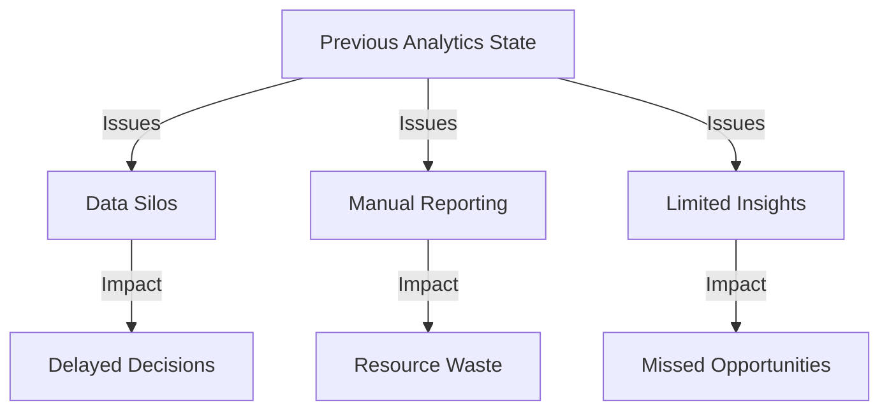
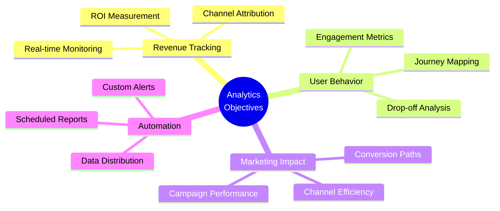
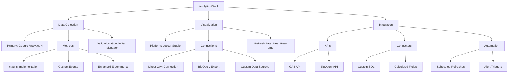
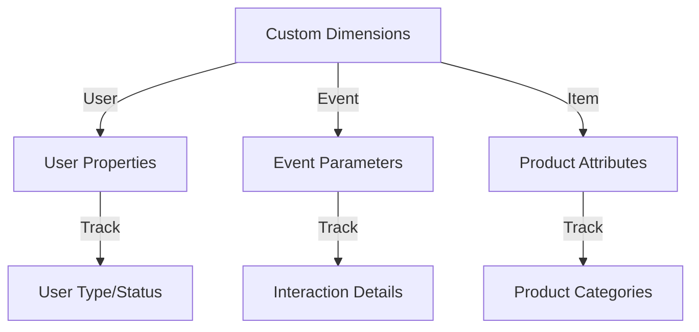
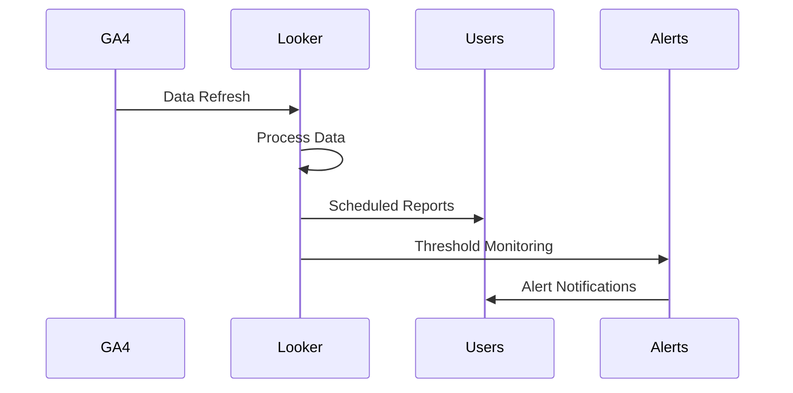
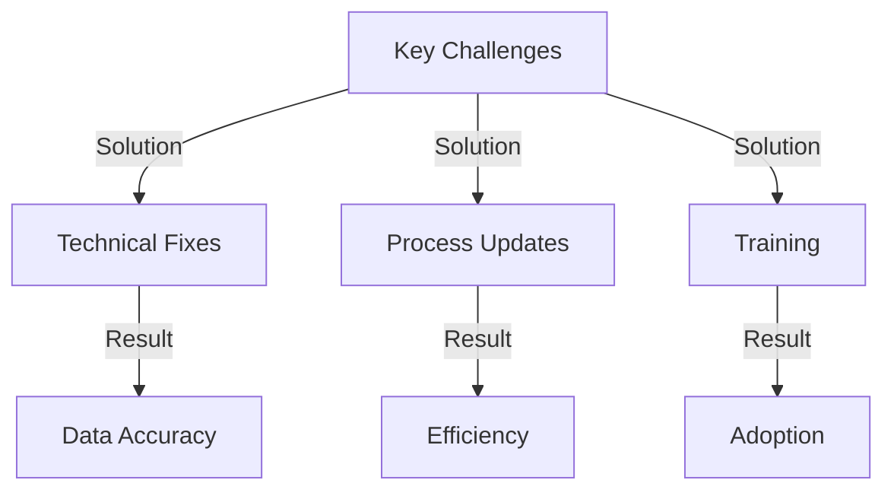
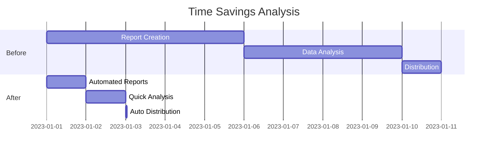

# Comphrensive Web Analytics: GA4 & Looker Studio

### Table of Contents:

- [1. Intoduction](#Introduction)
- [2. Problem Statement And Objectives](#2-problem-statement-and-objectives)
- [3. Strategic Approach](#3-strategic-approach)
- [4. GA4 Technical Implementation](#4-ga4-technical-implementation)
- [5. Looker Studio Implementation](#5-looker-studio-implementation)
- [6. Automated Reporting System](#6-automated-reporting-sysytem)
- [7. Technical Challenges And Solutions](#7-technical-challenges-and-solutions)
- [8. Business Process Transformation](#8-business-process-transformation)

 
 
 
 

## 1. Introduction

#### Project Overview
Led the transformation of a complex, multi-channel e-commerce website's analytics infrastructure using GA4 and Looker Studio, resulting in a measurable revenue impact, conversion optimisation & marketing efficiency through data-driven decision making.

#### 1.1 Business Context

- Industry: E-commerce
- Size: Mid-Market
- Channels: Website, Social Media, Marketplace
  
***Scope:***
- Users: 40k User per Year
- Products: 500+ SKUs
 
***Stakeholders:***
- Primary: Marketing, Sales, Leadership
- Secondary: Finance,Operations

#### 1.2 Initial State Assessment

 
 
 
 

## 2. Problem Statement And Objectives

The organization faces fragmented data from multiple unconnected sources, inconsistent tracking accuracy, and limited accessibility for self-service analytics. Reporting is manual-heavy, restricted to monthly updates, and offers shallow insights, while a legacy Universal Analytics setup, disconnected systems, and high technical debt create significant technical barriers.

### 2.1 Project Objectives

### 2.2 Success Metrics  

#### **Revenue**  
- **Target**: Increase overall revenue by 25%.  
- **Tracking**: Implement real-time revenue monitoring.   

#### **Efficiency**  
- **Reporting**: Reduce reporting time by 75% through automation.  
- **Analysis**: Enable self-service capabilities for quicker insights.  
- **Distribution**: Automate distribution of key reports and insights.  

#### **Engagement**  
- **User Tracking**: Achieve cross-platform user tracking for seamless analytics.  
- **Behavior Mapping**: Develop a complete map of user behavior to inform strategies.  
- **Conversion Path**: Visualize the entire conversion path for actionable insights.  

 
 
 
 

## 3. Strategic Approach

 
 
 
 

## 4. GA4 Technical Implementation

### 4.1 Event Tracking Structure  

#### **User Engagement**  
To measure how users interact with the platform, the following metrics are tracked:  
- **Page Views**: Enhanced measurement for precise tracking of user visits.  
- **Scroll Depth**: Custom threshold tracking to understand engagement with content.  
- **Time on Page**: Monitoring engaged sessions to gauge meaningful interactions.  

#### **Conversion Tracking**  
Focusing on critical conversion points to drive business goals:  
- **Purchases**:  
  - Parameters: `transaction_id`, `value`, and `items` for detailed transaction data.  
  - Attribution: Data-driven models ensure accurate credit allocation.  
- **Leads**:  
  - Forms: Tracks form interactions to measure lead generation.
  - Contact: Tracks user engagement with contact methods for follow-up opportunities.  

#### **Custom Events**  
Tailored events to track unique user actions and business KPIs:  
- **User Journey**: Includes tracking key steps such as product views, add-to-cart actions, and checkout steps.  
- **Engagement**: Measures specific interactions like video plays, blog reads, and tool usage.  
- **Business Metrics**: Tracks essential actions like pricing page views. 

### 4.2 Custom Dimensions Setup

 
 
 
 

## 5. Looker Studio Implementation

### 5.1 Dashboard Architecture  

#### **Executive Dashboard**  
Designed for high-level decision-makers, this dashboard provides a quick overview of critical business metrics:  
- **Key Metrics**: Revenue, users, and conversion rate to track performance.  
- **Time Frames**: Includes daily, weekly, monthly, and year-over-year (YoY) trends for comprehensive temporal analysis.  
- **Comparisons**: Displays target vs. actual values and period-over-period insights to assess progress against goals.  

#### **Marketing Dashboard**  
Built for marketing teams to evaluate channel performance and user behavior:  
- **Channels**: Tracks performance across paid, organic, social, and direct channels.  
- **Campaigns**: Monitors campaign ROI, attribution, and overall performance.  
- **User Behavior**: Provides journey maps and identifies drop-off points for optimization.  

#### **Product Dashboard**  
Focused on product teams to analyze user engagement and feedback:  
- **Engagement Metrics**: Tracks feature usage and time spent on pages to understand user interaction.  
- **Conversion Analysis**: Includes funnel and path analyses to identify bottlenecks in the user journey.  
- **User Feedback**: Displays survey results and user ratings for actionable insights.  

This dashboard architecture ensures all stakeholders—executives, marketers, and product teams—have access to tailored, actionable data to drive decisions and improve outcomes.  

 
 
 
 

## 6. Automated Reporting System

### 6.1 Report Automation Flow

### 6.2 Alert Configuration

- **Revenue Alerts**: Triggered when daily revenue falls below 20% of the target. Notifications are sent immediately to the Sales Director and Marketing Manager.  
- **Traffic Alerts**: Activated if hourly traffic drops by 30% below average. Notifications are sent within 1 hour to the Traffic Manager and Tech Lead.  
- **Conversion Alerts**: Issued when the conversion rate drops below 2%. A daily digest is sent to the CRO Team and Product Manager.  

 
 
 
 

## 7. Technical Challenges And Solutions

### 7.1 Tackling Data Accuracy Challenges  

#### **Duplicate Events**  
- **The Problem**: Events firing multiple times, leading to inflated metrics.  
- **The Solution**: Implemented a **debounce mechanism** to prevent redundant event triggers.  
- **The Impact**: Achieved a **98% reduction in duplicate events**, ensuring cleaner and more reliable data.  

#### **Misattribution**  
- **The Problem**: Inconsistent attribution across devices caused fragmented user journeys.  
- **The Solution**: Introduced **User ID tracking**, enabling seamless cross-device attribution.  
- **The Impact**: Gained **85% clarity** in mapping user journeys, boosting attribution accuracy.  

#### **Data Loss**  
- **The Problem**: Data gaps due to script loading failures during user interactions.  
- **The Solution**: Deployed a **Google Tag Manager (GTM) strategy** to ensure robust tracking.  
- **The Impact**: Secured a **99.9% data capture rate**, eliminating data loss issues.  

This proactive approach transformed data reliability, empowering stakeholders with accurate insights for confident decision-making.

### 7.2 Challenge Resolution Matrix

 
 
 
 

## 8. Business Process Transformation

### 8.1 Workflow Improvements  

#### **Reporting Enhancements**  
- **Before**:  
  - Frequency: Monthly reporting.  
  - Effort: 40 hours per month spent on manual processes.  
  - Accuracy: 85%, with room for errors.  
- **After**:  
  - Frequency: Real-time updates.  
  - Effort: Only 2 hours per month thanks to automation.  
  - Accuracy: Improved to 99.5%.  

#### **Decision-Making Efficiency**  
- **Before**: Decisions were based on insights from weekly meetings, delaying response times.  
- **After**: Real-time alerts replaced meetings, enabling immediate action.  
- **Improvement**: Decision-making became **85% faster**, driving agility in business processes.  

These workflow optimizations streamlined operations, reduced manual effort, and significantly improved decision-making speed and accuracy.  

### 8.2 Efficiency Gains

