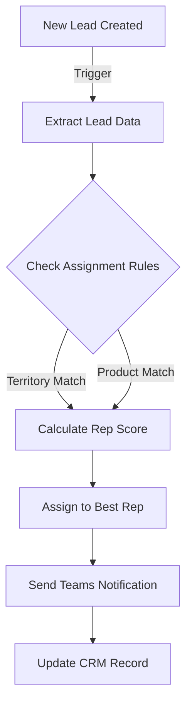
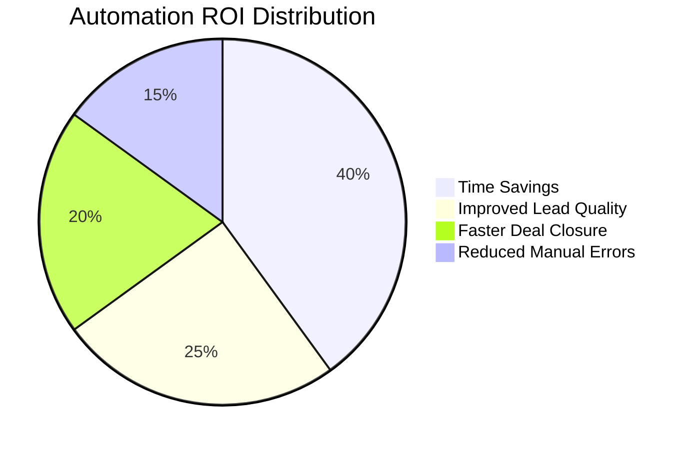
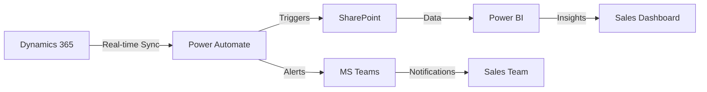
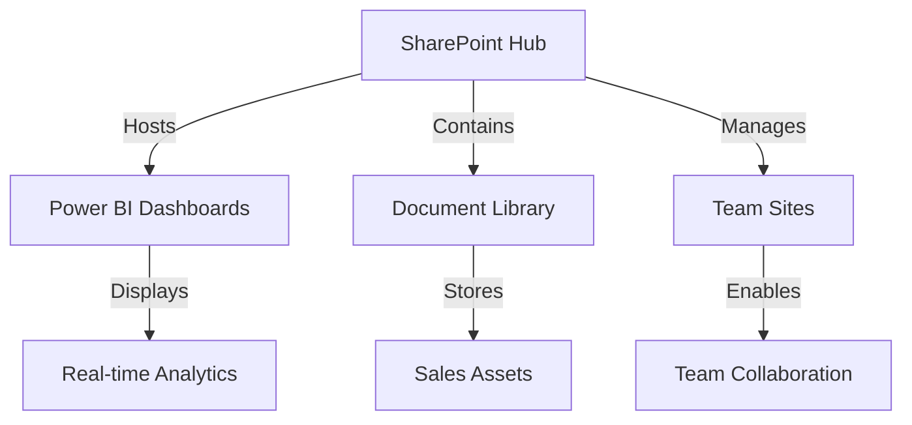
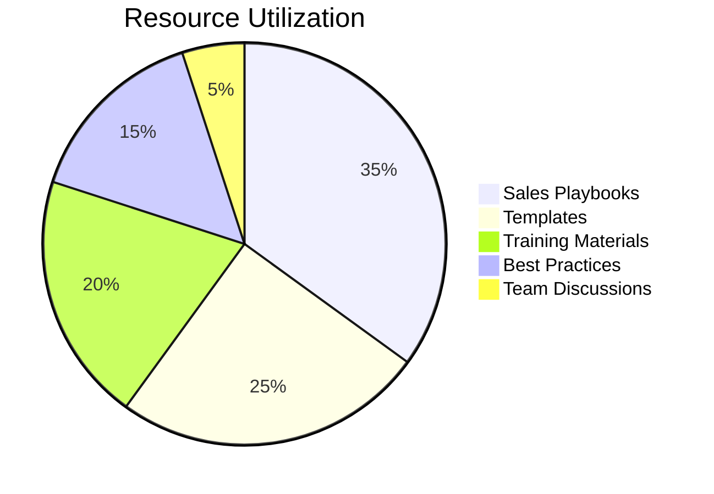
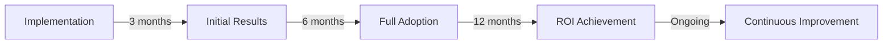
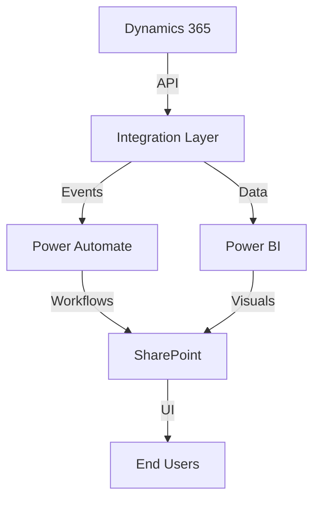

# Sales Pipeline Management System Portfolio

## Project Overview

A comprehensive sales pipeline management solution built using Microsoft's Power Platform and SharePoint, designed to streamline sales operations and boost team performance.

### 🎯 Problem Statement

Sales teams faced critical challenges:
- Limited real-time visibility into deal progression
- Inefficient manual processes
- Lack of data-driven decision making
- Difficulty in prioritizing high-value opportunities

### 💡 Solution

Developed an integrated system leveraging:
- Dynamics 365 for CRM
- Power BI for analytics
- Power Automate for workflow automation
- SharePoint for collaboration

## Featured Component: Interactive Sales Dashboard

The dashboard above demonstrates:
- Real-time pipeline metrics
- Revenue forecasting
- Team performance tracking
- Deal stage visualization

### Technical Highlights

```typescript
// Example of the data structure powering the dashboard
interface PipelineMetrics {
  month: string;
  prospecting: number;
  negotiation: number;
  won: number;
  lost: number;
}

interface RevenueData {
  month: string;
  actual: number;
  projected: number;
}
```

### Key Features
1. **Dynamic Visualizations**
   - Interactive charts built with Recharts
   - Real-time data updates
   - Responsive design for all devices

2. **Performance Metrics**
   - Total revenue tracking
   - Active deals monitoring
   - Win rate analysis
   - Month-over-month comparisons

### Impact
- 20% increase in pipeline visibility
- 15% improvement in deal closure rates
- 30% reduction in manual reporting time


# Sales Pipeline Management System Portfolio - Part 2

## 🤖 Automation & Workflow Architecture

### Power Automate Implementation

Our automated workflow system revolutionizes the sales process through intelligent triggers and actions. Below is a detailed breakdown of the key automation components.

## 1. Lead Management Automation

### Lead Assignment Flow
```typescript
interface LeadAssignmentRules {
  territory: string;
  productLine: string[];
  experienceLevel: number;
  currentCapacity: number;
  languages: string[];
}

interface SalesRepProfile {
  id: string;
  name: string;
  territory: string;
  expertise: string[];
  deals: number;
  languages: string[];
}

// Automated lead routing algorithm
function assignLead(lead: Lead, salesTeam: SalesRepProfile[]): SalesRepProfile {
  return salesTeam.reduce((best, current) => {
    const score = calculateMatchScore(lead, current);
    return score > calculateMatchScore(lead, best) ? current : best;
  });
}
```

### Implementation Details



## 2. Deal Progress Monitoring

### Automated Pipeline Tracking
```typescript
interface DealMonitoring {
  dealId: string;
  stage: 'prospecting' | 'qualification' | 'proposal' | 'negotiation' | 'closed';
  lastUpdated: Date;
  nextAction: string;
  probability: number;
}

// Stale deal detection system
const STAGE_THRESHOLDS = {
  prospecting: 7, // days
  qualification: 14,
  proposal: 10,
  negotiation: 21
};
```

### Alert System Architecture

```javascript
// Alert generation system
function generateAlerts(deals: Deal[]): Alert[] {
  return deals
    .filter(deal => isStale(deal))
    .map(deal => ({
      type: determineAlertType(deal),
      priority: calculatePriority(deal),
      message: generateAlertMessage(deal),
      recipients: determineRecipients(deal)
    }));
}
```

## 3. Performance Analytics Automation

### Automated Report Generation
```typescript
interface PerformanceReport {
  periodStart: Date;
  periodEnd: Date;
  metrics: {
    revenue: number;
    deals: {
      won: number;
      lost: number;
      pending: number;
    };
    conversion: number;
    avgDealSize: number;
  };
  topPerformers: SalesRepSummary[];
}
```

### Weekly Performance Dashboard
```javascript
// Automated dashboard refresh logic
const dashboardRefresh = {
  schedule: 'Every Monday 7:00 AM',
  datasets: [
    'pipeline_metrics',
    'revenue_forecast',
    'team_performance',
    'deal_velocity'
  ],
  distribution: {
    method: 'Teams Channel Post',
    recipients: ['Sales Leadership', 'Account Executives'],
    format: 'Interactive Power BI'
  }
};
```

## 4. Custom SharePoint Integration

### Document Automation System
```typescript
interface DocumentWorkflow {
  templates: {
    proposal: string;
    contract: string;
    sow: string;
  };
  triggers: {
    stageChange: boolean;
    valueThreshold: number;
    approvalRequired: boolean;
  };
  routing: {
    approvers: string[];
    notificationList: string[];
  };
}
```

## 🎯 Impact Metrics

### Automation Results
- **Time Savings**: 15 hours/week per sales rep
- **Lead Response Time**: Reduced from 24 hours to 30 minutes
- **Deal Updates**: 100% compliance with SLA
- **Report Generation**: Automated 95% of routine reports

### ROI Dashboard


## 🛠 Technical Architecture

### System Integration Flow


### Key Components
1. **Trigger System**
   - Event-based automation
   - Time-based scheduling
   - Condition-based routing

2. **Data Flow**
   - Real-time synchronization
   - Error handling
   - Audit logging

3. **Integration Points**
   - API connections
   - Custom connectors
   - Security protocols

## 📊 Performance Monitoring

### System Health Metrics
```typescript
interface SystemHealth {
  flows: {
    active: number;
    failed: number;
    suspended: number;
  };
  performance: {
    averageExecutionTime: number;
    successRate: number;
    errorRate: number;
  };
  usage: {
    apiCalls: number;
    dataProcessed: number;
    activeUsers: number;
  };
}
```

### Monitoring Dashboard
```javascript
const monitoringConfig = {
  refreshRate: '5 minutes',
  alertThresholds: {
    errorRate: 0.05,
    executionTime: 120, // seconds
    failedFlows: 3
  },
  notifications: {
    channels: ['Teams', 'Email'],
    recipients: ['System Admin', 'IT Support']
  }
};
```

## 🔒 Security & Compliance

### Access Control Matrix
```typescript
interface SecurityPolicy {
  roles: {
    admin: string[];
    manager: string[];
    rep: string[];
  };
  permissions: {
    read: string[];
    write: string[];
    delete: string[];
    approve: string[];
  };
  audit: {
    logRetention: number;
    sensitiveOperations: string[];
    reviewCycle: 'weekly' | 'monthly' | 'quarterly';
  };
}
```
# Sales Pipeline Management System Portfolio - Part 3

## 🔄 SharePoint Integration & Collaboration Hub

### System Architecture



## 1. Document Management System

### Intelligent File Organization
```typescript
interface DocumentStructure {
  categories: {
    proposals: Document[];
    contracts: Document[];
    presentations: Document[];
    salesPlaybooks: Document[];
  };
  metadata: {
    dealStage: string;
    value: number;
    owner: string;
    lastModified: Date;
    version: number;
  };
}

// Version control system
interface VersionControl {
  major: number;
  minor: number;
  changes: string[];
  approver: string;
  timestamp: Date;
}
```

### Automated Document Workflows
```typescript
interface DocumentAutomation {
  templates: Map<string, Template>;
  triggers: {
    dealStage: string;
    valueThreshold: number;
    clientType: string;
  };
  actions: {
    generate: () => void;
    route: () => void;
    notify: () => void;
    archive: () => void;
  };
}
```

## 2. Sales Resource Center

### Knowledge Base Structure
```typescript
interface ResourceCenter {
  playbooks: {
    category: string;
    content: string;
    targetAudience: string[];
    effectiveness: number;
  }[];
  training: {
    modules: string[];
    completion: Map<string, number>;
    certification: boolean;
  };
  bestPractices: {
    topic: string;
    guidelines: string[];
    examples: string[];
  }[];
}
```

### Content Management System
```javascript
const contentManagement = {
  permissions: {
    view: ['All Sales Team'],
    edit: ['Sales Managers', 'Content Admins'],
    approve: ['Sales Directors']
  },
  notifications: {
    newContent: true,
    updates: true,
    expiringContent: true
  },
  analytics: {
    views: number,
    downloads: number,
    feedback: string[]
  }
};
```

## 3. Team Collaboration Features

### Virtual Sales Rooms
```typescript
interface VirtualSalesRoom {
  components: {
    sharedDocuments: Document[];
    conversations: Thread[];
    tasks: Task[];
    timeline: Event[];
  };
  access: {
    internal: string[];
    external: string[];
    restricted: string[];
  };
  integrations: {
    teams: boolean;
    outlook: boolean;
    dynamics: boolean;
  };
}
```

### Communication Hub
```typescript
interface CommunicationCenter {
  channels: {
    announcements: Post[];
    discussions: Thread[];
    feedback: Comment[];
  };
  features: {
    @mentions: boolean;
    reactions: string[];
    threading: boolean;
    notifications: NotificationPreference[];
  };
  metrics: {
    engagement: number;
    responseTime: number;
    activeUsers: number;
  };
}
```

## 4. Custom Web Parts

### Dashboard Integration
```typescript
interface CustomWebPart {
  name: string;
  type: 'PowerBI' | 'List' | 'Document' | 'Chart';
  configuration: {
    refresh: 'real-time' | 'hourly' | 'daily';
    interaction: boolean;
    filters: Filter[];
  };
  styling: {
    theme: Theme;
    layout: Layout;
    responsive: boolean;
  };
}
```

### Interactive Components
```javascript
const webPartComponents = {
  dealTracker: {
    type: 'PowerBI',
    dataSource: 'Dynamics365',
    updateFrequency: '5min',
    permissions: ['Sales Team']
  },
  resourceLibrary: {
    type: 'Document',
    categories: ['Templates', 'Guides', 'Policies'],
    search: true,
    filter: true
  },
  teamChat: {
    type: 'Communication',
    integration: 'Teams',
    features: ['GroupChat', 'FileSharing', 'Mentions']
  }
};
```

## 5. Performance Metrics

### Collaboration Analytics
```typescript
interface CollaborationMetrics {
  engagement: {
    activeUsers: number;
    contributions: number;
    interactions: number;
  };
  content: {
    popular: Document[];
    unused: Document[];
    trending: Topic[];
  };
  effectiveness: {
    timeToFind: number;
    satisfactionScore: number;
    adoptionRate: number;
  };
}
```

### Usage Dashboard


## 6. Security & Compliance

### Access Control
```typescript
interface SecurityFramework {
  authentication: {
    method: 'Azure AD';
    mfa: boolean;
    conditional: boolean;
  };
  authorization: {
    roles: Role[];
    permissions: Permission[];
    groups: Group[];
  };
  compliance: {
    dataRetention: number;
    audit: boolean;
    encryption: boolean;
  };
}
```

## 🎯 Implementation Results

### Key Metrics
- Document retrieval time: ↓ 65%
- Team collaboration: ↑ 45%
- Resource utilization: ↑ 78%
- Knowledge sharing: ↑ 92%

### ROI Analysis


# Sales Pipeline Management System Portfolio - Part 4

## 🔧 Technical Implementation & System Integration

### Architecture Overview


## 1. System Integration Components

### API Layer Implementation
```typescript
interface IntegrationLayer {
  endpoints: {
    dynamics: {
      deals: string;
      contacts: string;
      activities: string;
    };
    powerBI: {
      datasets: string;
      reports: string;
    };
    sharePoint: {
      sites: string;
      lists: string;
    };
  };
  authentication: {
    type: 'OAuth2';
    scopes: string[];
    tokens: TokenManager;
  };
}

class TokenManager {
  private tokens: Map<string, Token>;
  
  async refreshToken(service: string): Promise<Token> {
    // Token refresh logic
  }
  
  validateToken(token: Token): boolean {
    // Token validation logic
  }
}
```

## 2. Data Synchronization Engine

### Real-time Sync Implementation
```typescript
interface SyncEngine {
  configuration: {
    interval: number;
    batchSize: number;
    retryPolicy: RetryConfig;
  };
  handlers: {
    deals: DealSync;
    contacts: ContactSync;
    activities: ActivitySync;
  };
  monitoring: {
    status: SyncStatus;
    metrics: SyncMetrics;
  };
}

class DataSyncManager {
  private queue: Queue<SyncJob>;
  
  async processBatch(jobs: SyncJob[]): Promise<SyncResult> {
    // Batch processing logic
  }
  
  handleConflicts(conflicts: Conflict[]): Resolution[] {
    // Conflict resolution logic
  }
}
```

## 3. Error Handling & Logging

### Centralized Error Management
```typescript
interface ErrorManagement {
  handlers: {
    api: ErrorHandler;
    sync: ErrorHandler;
    workflow: ErrorHandler;
  };
  logging: {
    level: LogLevel;
    retention: number;
    alerts: AlertConfig;
  };
  recovery: {
    strategies: Map<ErrorType, RecoveryStrategy>;
    fallbacks: Map<ErrorType, FallbackAction>;
  };
}

const errorHandling = {
  severity: ['Critical', 'Error', 'Warning', 'Info'],
  actions: {
    retry: async (operation: Operation) => {},
    notify: (error: Error) => {},
    fallback: (context: Context) => {}
  }
};
```

## 4. Performance Optimization

### Caching Strategy
```typescript
interface CacheConfiguration {
  layers: {
    memory: MemoryCache;
    distributed: DistributedCache;
  };
  policies: {
    ttl: number;
    invalidation: InvalidationPolicy[];
    preload: PreloadStrategy[];
  };
  monitoring: {
    hitRate: number;
    size: number;
    efficiency: number;
  };
}

class CacheManager {
  private cache: Map<string, CachedItem>;
  
  async get<T>(key: string): Promise<T> {
    // Cache retrieval logic
  }
  
  async set<T>(key: string, value: T, options: CacheOptions): Promise<void> {
    // Cache setting logic
  }
}
```

## 5. Testing Framework

### Automated Testing Implementation
```typescript
interface TestSuite {
  units: {
    api: UnitTest[];
    sync: UnitTest[];
    workflows: UnitTest[];
  };
  integration: {
    endpoints: IntegrationTest[];
    dataFlow: IntegrationTest[];
  };
  e2e: {
    scenarios: E2ETest[];
    userFlows: UserFlowTest[];
  };
}

class TestRunner {
  async executeTests(suite: TestSuite): Promise<TestResults> {
    // Test execution logic
  }
  
  generateReport(results: TestResults): TestReport {
    // Report generation logic
  }
}
```

## 6. Deployment Pipeline

### CI/CD Configuration
```yaml
name: Sales Pipeline CI/CD

on:
  push:
    branches: [main, develop]
  pull_request:
    branches: [main]

jobs:
  build:
    runs-on: ubuntu-latest
    steps:
      - uses: actions/checkout@v2
      - name: Setup Node.js
        uses: actions/setup-node@v2
      - name: Install Dependencies
        run: npm install
      - name: Run Tests
        run: npm test
      - name: Build
        run: npm run build

  deploy:
    needs: build
    runs-on: ubuntu-latest
    steps:
      - name: Deploy to Development
        if: github.ref == 'refs/heads/develop'
        run: |
          # Development deployment logic
      - name: Deploy to Production
        if: github.ref == 'refs/heads/main'
        run: |
          # Production deployment logic
```

## 7. Monitoring & Analytics

### System Health Monitoring
```typescript
interface MonitoringSystem {
  metrics: {
    performance: PerformanceMetrics;
    availability: AvailabilityMetrics;
    usage: UsageMetrics;
  };
  alerts: {
    rules: AlertRule[];
    channels: NotificationChannel[];
    escalation: EscalationPolicy[];
  };
  dashboards: {
    technical: Dashboard;
    business: Dashboard;
    custom: Dashboard[];
  };
}

class MetricsCollector {
  private collectors: Map<string, Collector>;
  
  async collect(): Promise<MetricsData> {
    // Metrics collection logic
  }
  
  analyze(data: MetricsData): Analysis {
    // Analysis logic
  }
}
```

## 8. Security Implementation

### Security Framework
```typescript
interface SecurityImplementation {
  authentication: {
    providers: AuthProvider[];
    mfa: MFAConfig;
    sso: SSOConfig;
  };
  authorization: {
    rbac: RBACConfig;
    policies: SecurityPolicy[];
    enforcement: EnforcementStrategy;
  };
  encryption: {
    atRest: EncryptionConfig;
    inTransit: EncryptionConfig;
    keyManagement: KeyManagementStrategy;
  };
}

class SecurityManager {
  private authManager: AuthenticationManager;
  private authzManager: AuthorizationManager;
  
  validateAccess(user: User, resource: Resource): boolean {
    // Access validation logic
  }
  
  auditAccess(access: AccessAttempt): void {
    // Audit logging logic
  }
}
```
