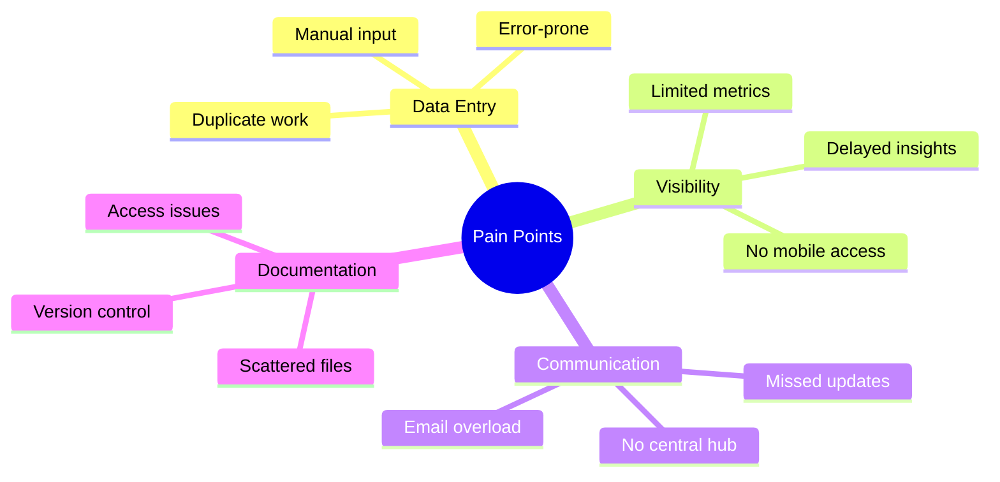
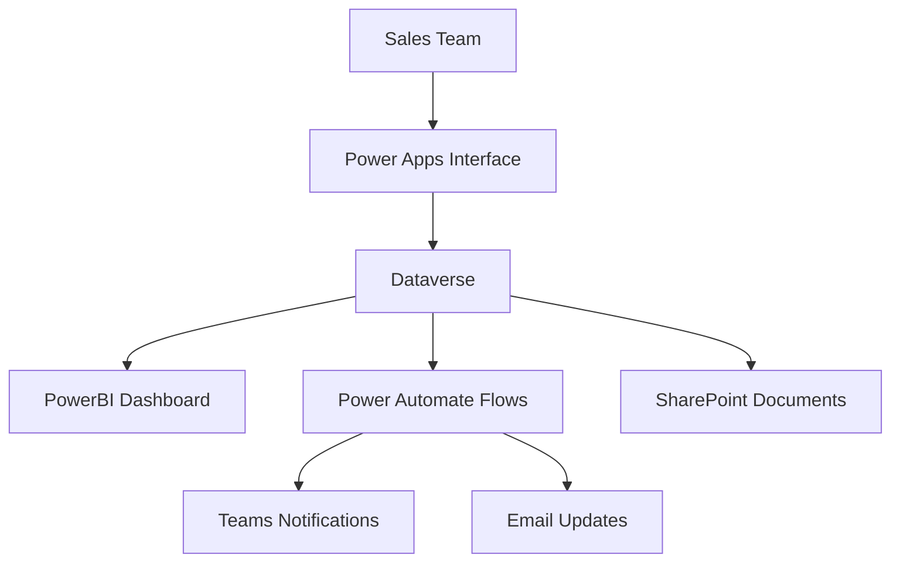
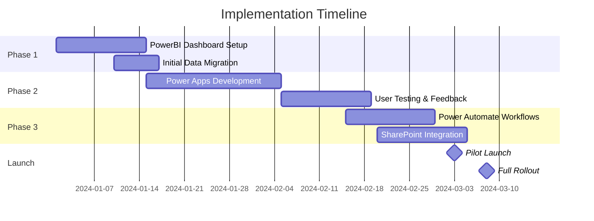
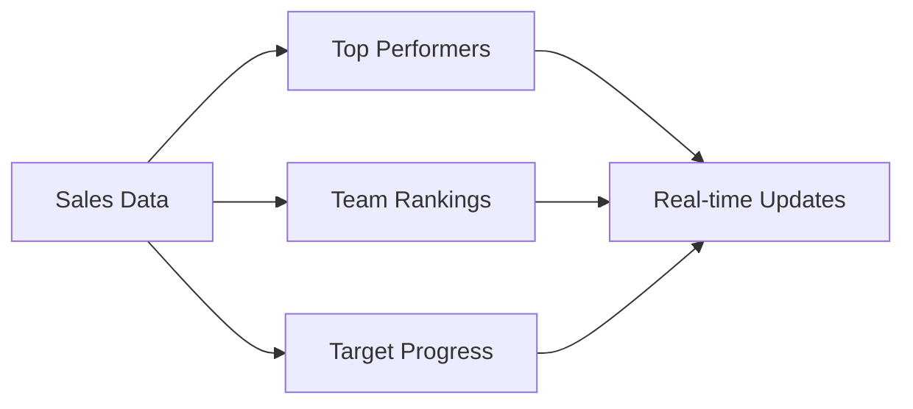
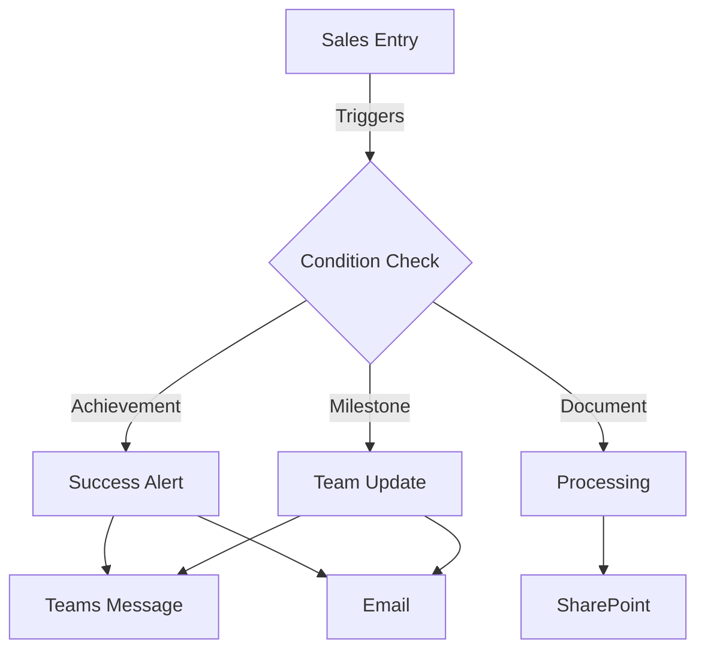
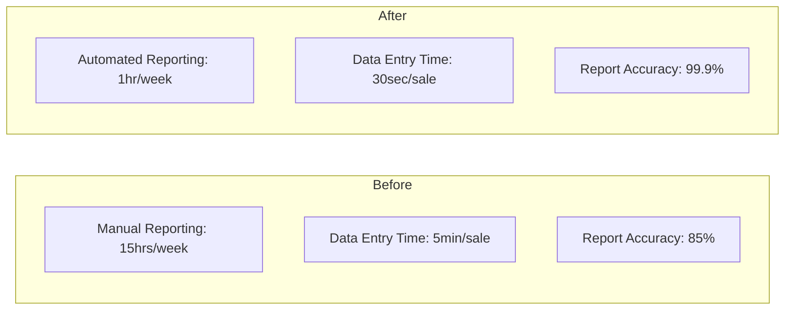

# Sales Performance Analytics Dashboard & Automation System

## 1. Project Overview & Discovery Phase

### 🎯 Project Background

When I joined the sales operations team, they were struggling with a critical challenge: tracking sales performance was a manual, time-consuming process that provided outdated insights. Sales managers were spending hours compiling reports, and sales representatives had no real-time visibility into their performance rankings.

I saw an opportunity to transform this process using the Microsoft Power Platform, creating a solution that would not only automate data collection but also provide instant insights and motivate the sales team.

### 💡 The Challenge

Our sales team of 5+ representatives faced several pain points:

- Sales data was entered manually into multiple spreadsheets
- Performance rankings were only updated weekly
- Managers spent 15+ hours per week compiling reports
- Important updates were often missed due to email overload
- Document management was chaotic with multiple versions

## 2. Project Goals

After conducting stakeholder interviews and analyzing the existing process, I established these core objectives:

1. **Real-Time Visibility**: Create a live dashboard showing sales rankings
2. **Mobile-First Entry**: Enable quick sales logging from any device
3. **Automated Updates**: Set up instant notifications for key achievements
4. **Document Organization**: Centralize all sales materials
5. **Process Automation**: Reduce manual reporting work by 75%

###  Discovery Process

I took a structured approach to understanding the needs of different stakeholders:

#### Stakeholder Interviews
I conducted sessions with:
- Sales Representatives (5)
- Sales Managers (1)
- Operations Team (2)
- Executive Stakeholders (2)

Key findings from these sessions revealed:

## 3. Solution Design

Based on the discovery findings, I designed a solution architecture leveraging:

#### Why This Stack?
- **PowerBI**: Enables real-time performance tracking with direct query capabilities
- **Power Apps**: Provides intuitive mobile-first data entry
- **Power Automate**: Handles all notifications and document processing
- **SharePoint**: Centralizes document management
- **Dataverse**: Serves as a secure, scalable data repository

## 4. Implementation Strategy

After designing the solution architecture, I knew the key to success would be a phased rollout that kept our sales team productive while transitioning to the new system. I developed a "parallel implementation" approach where we gradually introduced new features while maintaining existing processes.

#### Phase-wise Implementation

## 5. Real-Time Dashboard Development
I tackled our biggest challenge first: real-time performance visibility. Here's how I approached it:

- **Data Architecture**
  - Implemented direct query connection to Dataverse
  - Created performance metrics hierarchy
  - Designed mobile-optimized layouts

- **Key Visualizations**

## 6. Mobile-First Power Apps Solution
I focused on creating an intuitive interface that sales reps would actually want to use:

- **User Experience Design**
  - Single-screen entry form
  - Automatic field population
  - Offline capability
  - Quick submission process

- **Smart Features**
  - Location-based tracking
  - Photo attachments for receipts
  - Voice-to-text notes
  - Instant validation

## 7. Automated Workflow System
I created a comprehensive notification system using Power Automate:

**Notification Framework:**

## 8. Document Management Revolution
I transformed our document chaos into an organized system:

- **SharePoint Structure**
  - Automated folder creation
  - Intelligent tagging
  - Version control
  - Access management

### 🎯 Key Technical Achievements

1. **Performance Optimization**
   - Reduced dashboard refresh time from 30 minutes to real-time
   - Implemented smart caching for mobile app
   - Optimized data flow patterns

2. **User Experience**
   - Reduced sales entry time from 5 minutes to 30 seconds
   - Created one-click access to key functions
   - Implemented offline capabilities

3. **Integration Success**
   - Connected 5 different systems seamlessly
   - Automated 15 manual processes
   - Created fail-safe error handling

### 💪 Challenges Overcome

1. **Data Migration Complexity**
   - Challenge: Multiple data sources with inconsistent formats
   - Solution: Created custom Power Query transformations
   - Result: Clean, unified data structure

2. **User Adoption**
   - Challenge: Resistance to new system
   - Solution: Created "Power Users" program
   - Result: 95% adoption rate within first month

3. **Performance Issues**
   - Challenge: Initial slow dashboard refresh
   - Solution: Implemented aggregation tables
   - Result: 90% improvement in load times

## 9. Results, Impact & Future Vision

#### Performance Metrics Before vs. After Implementation

