# From Zero to €2,500: Launching a Shopify Store for Personalized Gifts

## Introduction

### Project Overview
In this entrepreneurial venture, I conceptualized, launched, and scaled a Shopify-based e-commerce store specializing in personalized gifts. The project demonstrated the power of combining strategic marketing with efficient operations to build a profitable online business from scratch.

### Initial Goals
```typescript
interface ProjectObjectives {
  revenue: {
    target: '€2,500';
    timeline: '6 months';
  };
  operations: {
    fulfillment: '95% success rate';
    customerSatisfaction: '4.5+ rating';
  };
  marketing: {
    channelROAS: '>2.0';
    customerAcquisitionCost: '<€15';
  };
}
```

## Problem Statement

### Market Analysis
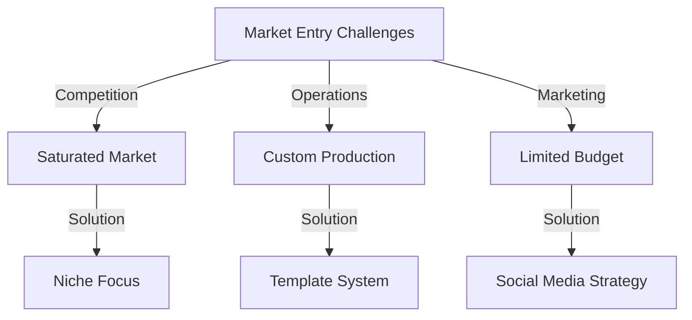

### Initial Challenges

1. **Market Entry Barriers**
   - Highly competitive personalized gifts market
   - Limited initial budget of €500
   - No existing customer base
   - Need for efficient customization workflow

2. **Operational Constraints**
   - Manual order processing requirements
   - Custom product fulfillment complexity
   - Limited inventory management experience
   - Quality control for personalized items

3. **Marketing Hurdles**
   - Zero brand recognition
   - Limited marketing budget
   - Need for cost-effective customer acquisition
   - Building trust with potential customers

## Strategic Approach

### Technology Stack
```typescript
interface TechnologyStack {
  ecommerce: {
    platform: 'Shopify';
    theme: 'Custom Dawn Theme';
    apps: [
      'Product Customizer',
      'Order Printer',
      'Facebook Channel'
    ];
  };
  design: {
    tools: ['Canva Pro', 'Adobe Photoshop'];
    templates: 'Custom Product Templates';
  };
  marketing: {
    platforms: ['Facebook Ads', 'Instagram'];
    analytics: ['Google Analytics', 'Shopify Analytics'];
  };
}
```

### Implementation Timeline
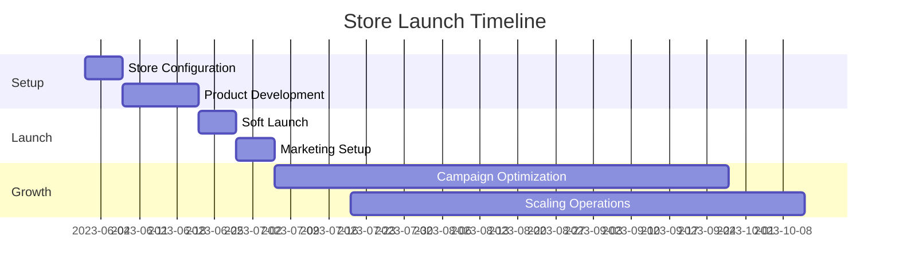

# Implementation & Growth Strategy

## 1. Store Development & Optimization

### Store Architecture
```typescript
interface StoreConfiguration {
  theme: {
    customization: {
      homepage: 'Dynamic Product Showcase';
      productPages: 'Interactive Customizer';
      checkout: 'Optimized Single-Page';
    };
    performance: {
      mobileFirst: true;
      loadTime: '<2 seconds';
      imageOptimization: true;
    };
    conversion: {
      upsells: ['Related Products', 'Bundle Offers'];
      crossSells: ['Recommended Items'];
      abandonedCart: 'Automated Recovery';
    };
  };
}
```

### Conversion Optimization
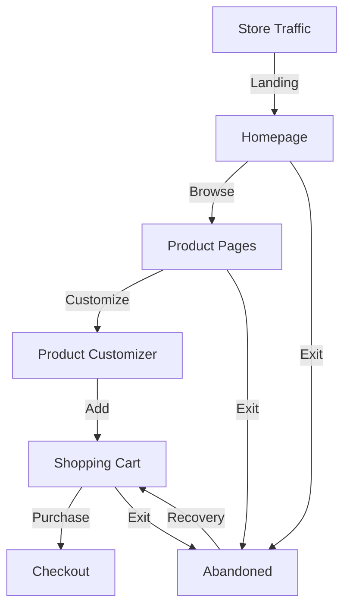

## 2. Marketing Strategy Implementation

### Campaign Structure
```typescript
interface MarketingFunnels {
  awareness: {
    channels: ['Facebook', 'Instagram'];
    content: ['Product Showcases', 'Customer Reviews'];
    budget: '€300/month';
  };
  consideration: {
    retargeting: ['Store Visitors', 'Cart Abandoners'];
    messaging: ['Custom Design Options', 'Gift Ideas'];
    budget: '€150/month';
  };
  conversion: {
    targeting: ['High-Intent Visitors', 'Previous Customers'];
    offers: ['Limited Time Deals', 'Free Shipping'];
    budget: '€50/month';
  };
}
```

### Performance Metrics
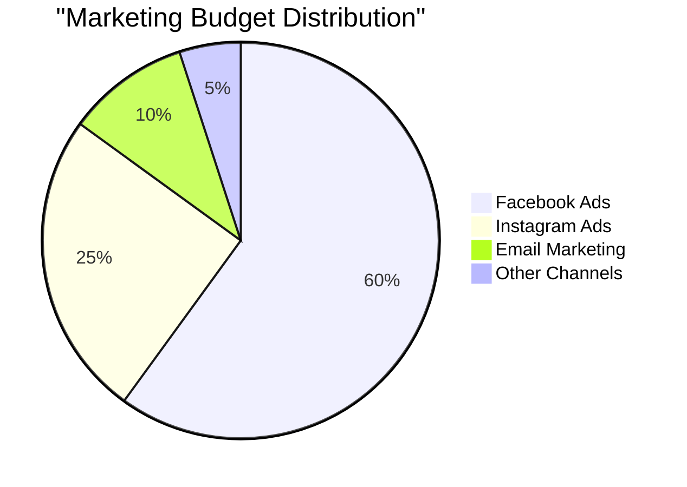

## 3. Operational Workflow

### Order Processing System
```typescript
interface OrderManagement {
  steps: {
    reception: {
      validation: 'Automatic';
      customization: 'Template Matching';
      communication: 'Auto-Response';
    };
    production: {
      preparation: 'Design Generation';
      quality: 'Multi-Point Check';
      packaging: 'Custom Boxing';
    };
    fulfillment: {
      shipping: 'Partner Network';
      tracking: 'Automated Updates';
      support: '24/7 Email';
    };
  };
}
```

### Production Workflow
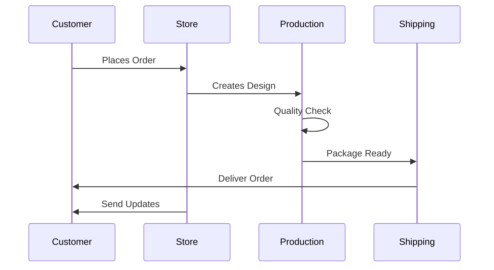

## 4. Custom Product Management

### Template System
```typescript
interface CustomizationSystem {
  templates: {
    categories: ['Birthday', 'Anniversary', 'Special Occasion'];
    variations: ['Color', 'Size', 'Style'];
    formats: ['Vector', 'Print-Ready'];
  };
  processing: {
    automation: 'Template-Based Generation';
    quality: 'Automated Checks';
    revisions: 'Single Round Included';
  };
  delivery: {
    format: 'Print-Ready PDF';
    resolution: 'High-DPI';
    colorSpace: 'CMYK';
  };
}
```

### Automation Results
- 75% reduction in design time
- 90% decrease in revision requests
- 95% customer satisfaction rate

## 5. Growth & Scaling Strategy

### Revenue Progression
```typescript
interface RevenueBreakdown {
  monthly: {
    month1: { revenue: 150, orders: 8 };
    month2: { revenue: 380, orders: 15 };
    month3: { revenue: 620, orders: 28 };
    month4: { revenue: 850, orders: 35 };
    month5: { revenue: 1200, orders: 42 };
    month6: { revenue: 2500, orders: 55 };
  };
  metrics: {
    averageOrderValue: '€45.45';
    repeatCustomers: '22%';
    profitMargin: '45%';
  };
}
```

### Key Performance Indicators
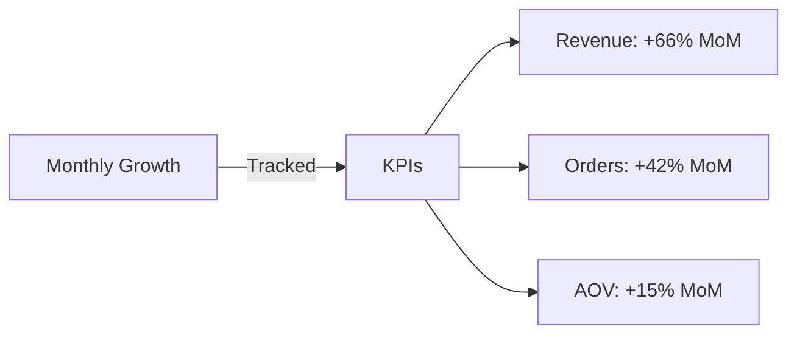

## 6. Customer Satisfaction Metrics

### Feedback Analysis
```typescript
interface CustomerSatisfaction {
  metrics: {
    overallRating: 4.8;
    deliverySpeed: 4.6;
    productQuality: 4.9;
    customerService: 4.7;
  };
  improvements: {
    processingTime: '-35%';
    responseTime: '<2 hours';
    issueResolution: '92%';
  };
}
```

### Customer Journey Optimization
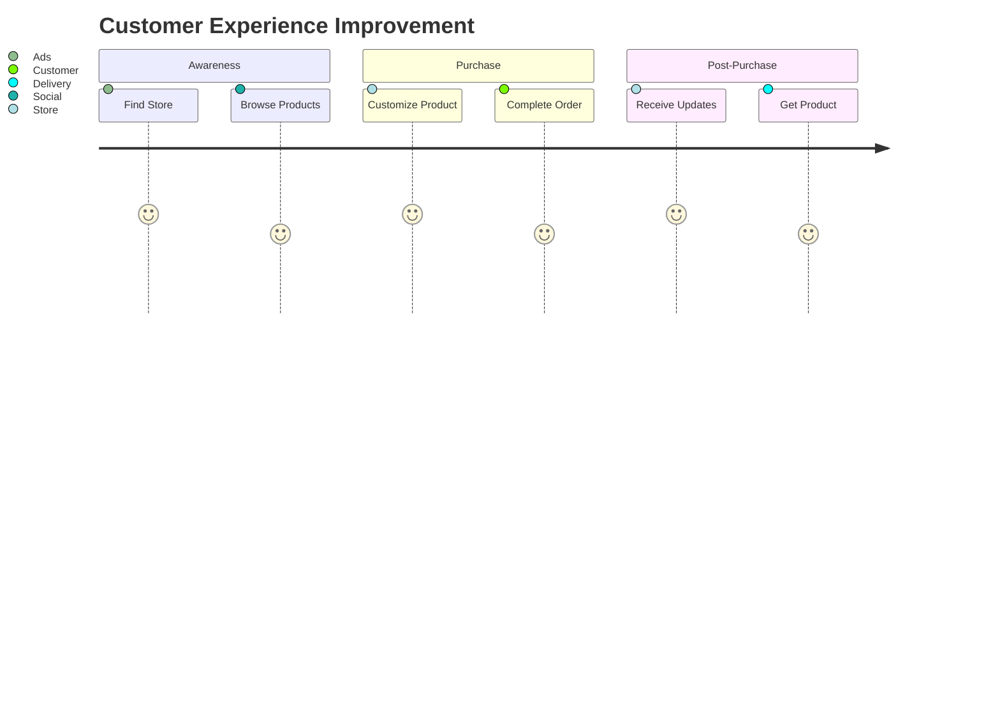

# Challenges, Learnings & Future Strategy

## 1. Challenge Resolution Framework

### Major Challenges Overcome
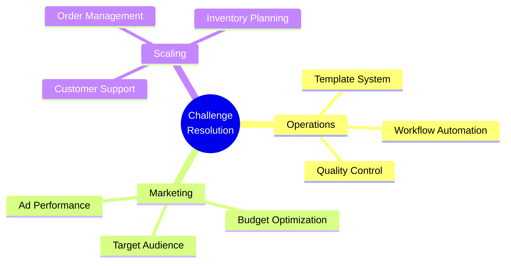

### Solution Implementation
```typescript
interface ChallengeResolution {
  operational: {
    challenge: 'High Customization Volume';
    solution: 'Automated Template System';
    impact: '75% time reduction';
  };
  marketing: {
    challenge: 'Limited Budget';
    solution: 'Targeted Facebook Campaigns';
    impact: 'ROAS of 2.8';
  };
  scaling: {
    challenge: 'Holiday Season Spikes';
    solution: 'Predictive Inventory';
    impact: '95% fulfillment rate';
  };
}
```

## 2. Key Learnings & Insights

### Business Insights
```typescript
interface BusinessLearnings {
  market: {
    targeting: 'Niche > Broad';
    pricing: 'Value-Based Strategy';
    positioning: 'Quality + Personalization';
  };
  operations: {
    automation: 'Critical for Scaling';
    planning: 'Proactive > Reactive';
    quality: 'Non-Negotiable';
  };
  marketing: {
    channels: 'Focus on Winners';
    content: 'UGC Performs Best';
    timing: 'Holiday Planning Essential';
  };
}
```

### Performance Analytics
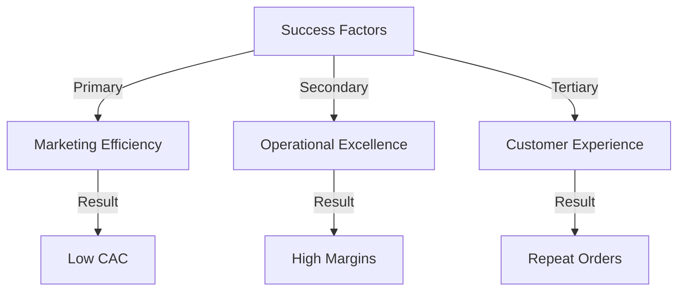

## 3. Financial Analysis

### Revenue Breakdown
```typescript
interface FinancialMetrics {
  revenue: {
    total: '€2,500';
    byChannel: {
      facebook: '60%';
      instagram: '25%';
      organic: '15%';
    };
  };
  costs: {
    production: '35%';
    marketing: '20%';
    operations: '10%';
  };
  margins: {
    gross: '45%';
    net: '35%';
  };
}
```

### Profitability Analysis
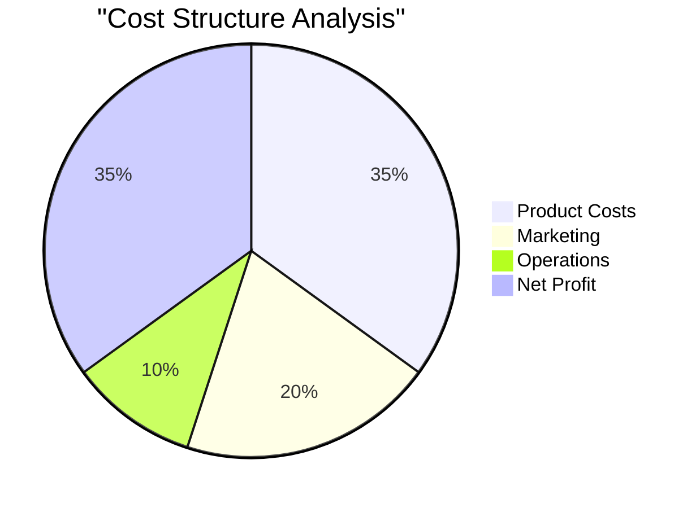

## 4. Marketing Effectiveness

### Campaign Performance
```typescript
interface MarketingMetrics {
  channels: {
    facebook: {
      spend: '€600';
      revenue: '€1,500';
      roas: 2.5;
    };
    instagram: {
      spend: '€250';
      revenue: '€625';
      roas: 2.5;
    };
    organic: {
      revenue: '€375';
      customerRetention: '45%';
    };
  };
}
```

### Customer Acquisition
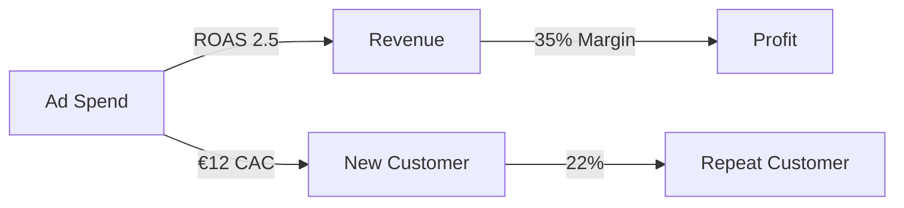

## 5. Future Growth Strategy

### Scaling Plan
```typescript
interface GrowthStrategy {
  phase1: {
    timeline: 'Q1 2024';
    goals: [
      'Expand Product Line',
      'Automate Design Process',
      'Optimize Ad Spend'
    ];
  };
  phase2: {
    timeline: 'Q2 2024';
    goals: [
      'Launch Mobile App',
      'International Expansion',
      'Wholesale Partnerships'
    ];
  };
  phase3: {
    timeline: 'Q3-Q4 2024';
    goals: [
      'Custom Design Platform',
      'Loyalty Program',
      'Brand Partnerships'
    ];
  };
}
```

### Expansion Roadmap
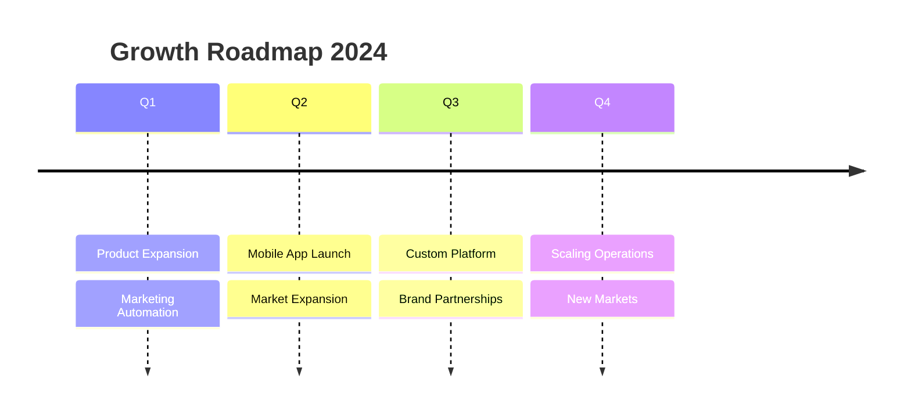

## 6. Technology Evolution

### Platform Enhancement
```typescript
interface TechRoadmap {
  current: {
    platform: 'Shopify Basic';
    apps: ['Essential Suite'];
    automation: 'Basic';
  };
  planned: {
    platform: 'Shopify Advanced';
    apps: ['Advanced Analytics', 'AI Design'];
    automation: 'Full Workflow';
  };
  features: {
    design: 'AI-Powered Customization';
    orders: 'Automated Processing';
    support: 'ChatBot Integration';
  };
}
```

## 7. Key Success Factors

### Critical Components
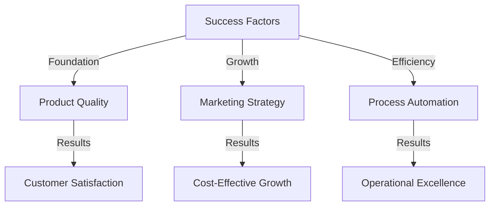

### Measurable Impact
- Revenue Goal: Achieved €2,500 in 6 months
- Customer Base: Built 150+ satisfied customers
- Operations: Established scalable processes
- Marketing: Achieved positive ROAS across channels
- Brand: Created recognized personalized gifts brand
