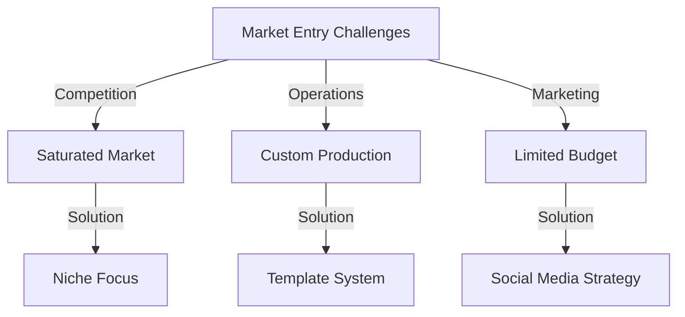
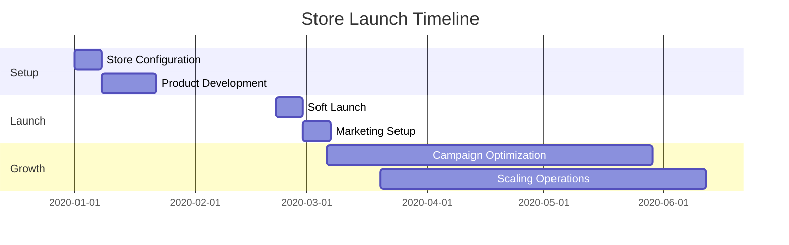
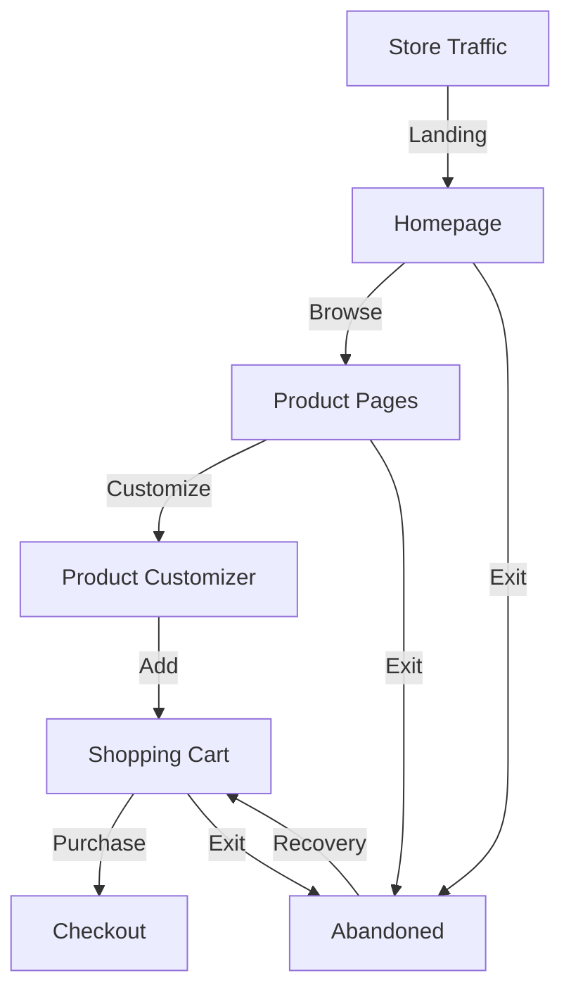
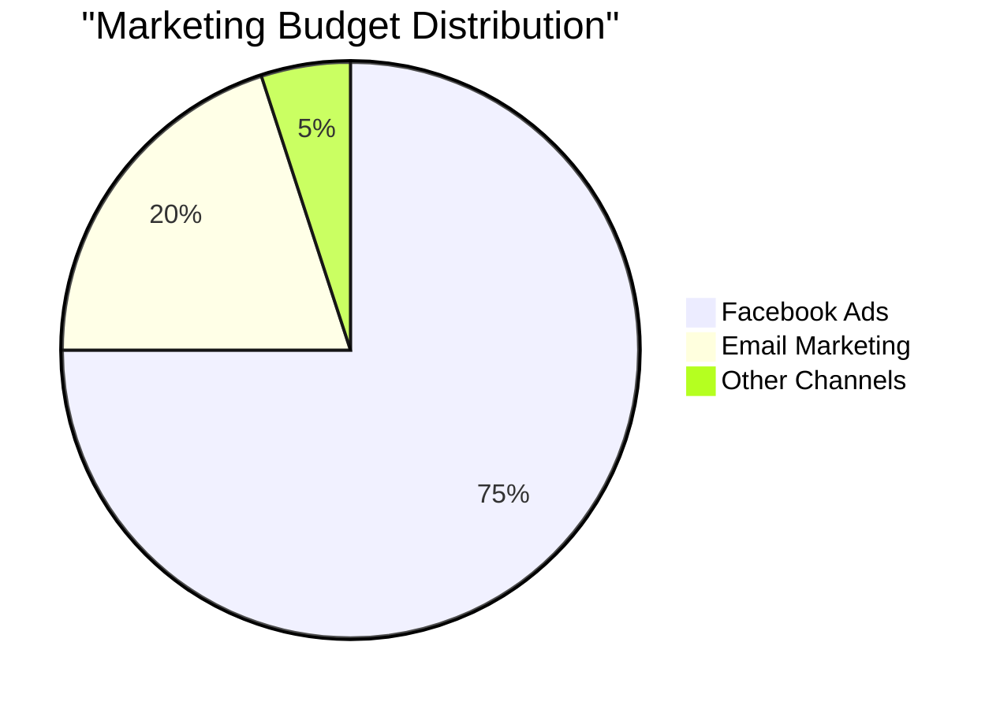
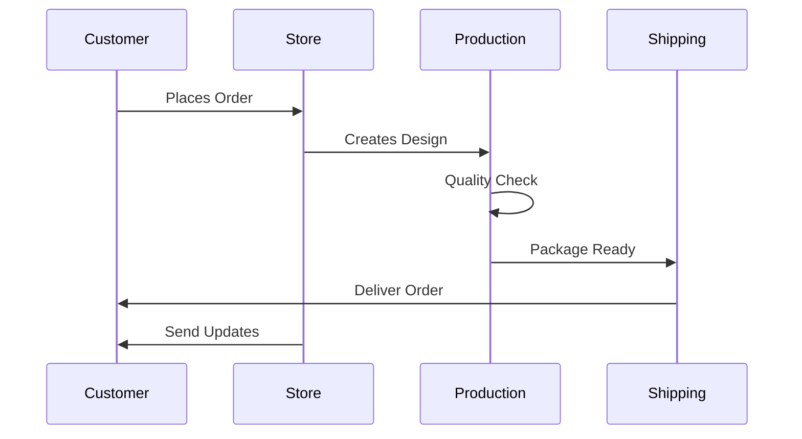
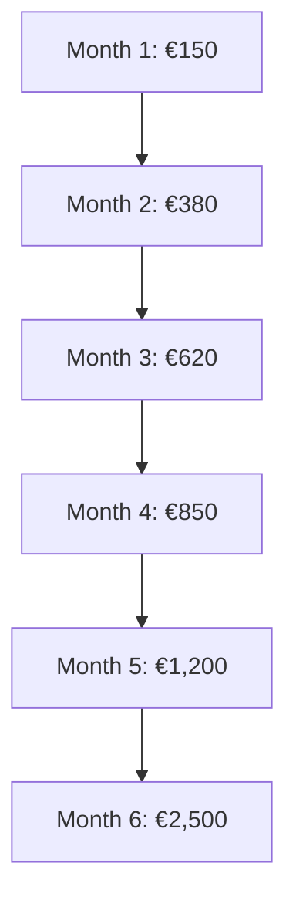
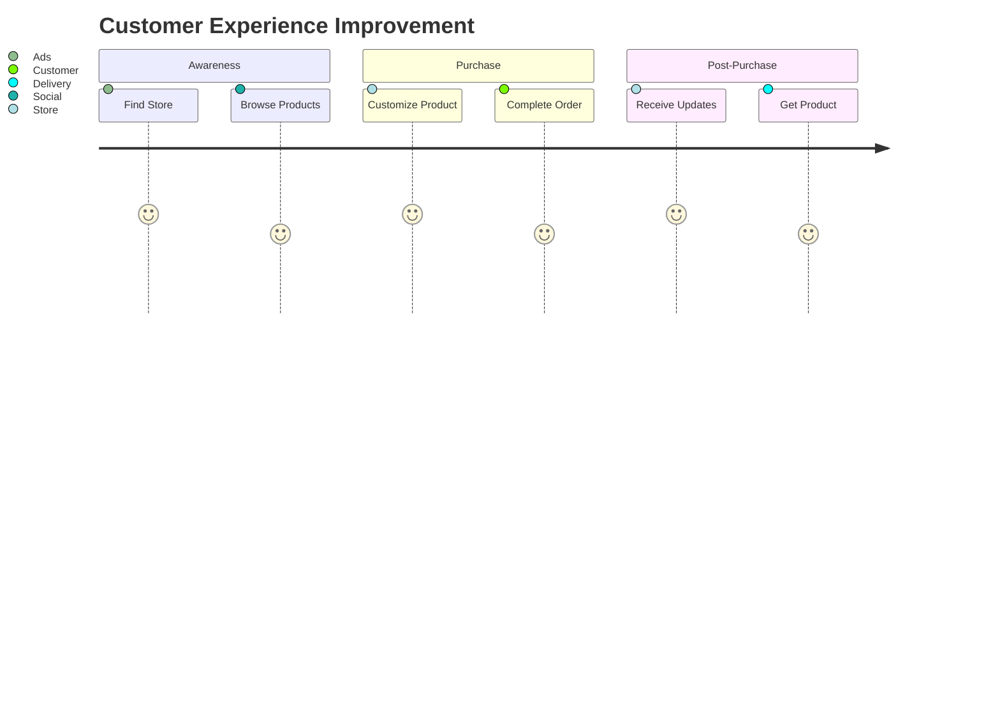

# From Zero to €2,500: Launching a Shopify Store for Personalized Gifts

### Table of Contents
1. [Project Overview](#1-project-overview)
2. [Market Analysis](#2-market-analysis)
3. [Technology Stack](#3-technology-stack)
4. [Store Development & Optimization](#4-store-development--optimization)
5. [Marketing Strategy Implementation](#5-marketing-strategy-implementation)
6. [Operational Workflow](#6-operational-workflow)
7. [Growth & Scaling Strategy](#7-growth--scaling-strategy)
8. [Customer Satisfaction Metrics](#8-customer-satisfaction-metrics)

<br>
<br>
<br>
<br>

## 1. Project Overview
In this entrepreneurial venture, I conceptualized, launched, and scaled a Shopify-based e-commerce store specializing in personalized gifts. The project demonstrated the power of combining strategic marketing with efficient operations to build a profitable online business from scratch.

### Initial Goals
When I kicked off this project, we set some ambitious but achievable targets for our first 6 months:
- ***Revenue Target:*** We aimed to hit €2,000 in revenue within the first 6 months
- ***Operations Excellence:*** Maintain a 95% success rate in order fulfillment by keeping our customer satisfaction rating above 4.5 stars
- ***Marketing Efficiency:*** Keep our cost of acquiring each new customer under €15

<br>
<br>
<br>
<br>


## 2. Market Analysis


### Initial Challenges

1. **Market Entry Barriers**
   - Highly competitive personalized gifts market
   - Limited initial budget of €500
   - No existing customer base

2. **Operational Constraints**
   - Manual order processing requirements
   - Custom product fulfillment complexity
   - Limited inventory management experience
   - Quality control for personalized items

3. **Marketing Hurdles**
   - Zero brand recognition
   - Limited marketing budget
   - Need for cost-effective customer acquisition
   - Building trust with potential customers


<br>
<br>
<br>
<br>


## 3. Technology Stack

I carefully selected tools that would give us the best balance of functionality, ease of use, and scalability:

**E-commerce Foundation**
- Built on Shopify for its reliability and robust features
- Used a customized version of the Dawn theme for optimal performance
- Enhanced functionality with key apps:
  - Product Customizer for personalized offerings
  - Facebook Channel for seamless social selling

**Design Tools**
- Leveraged Canva for quick, professional designs

**Marketing & Analytics**
- Focused on social media presence through:
  - Facebook Ads for targeted campaigns
- Tracked performance using:
  - Google Analytics for detailed visitor insights
  - Shopify Analytics for sales metrics

We chose these tools not just for their individual strengths, but for how well they work together, creating a seamless workflow from product listing to sale completion.

### Implementation Timeline


<br>
<br>
<br>
<br>


## 4. Store Development & Optimization

I designed our store with three key priorities: user experience, performance, and conversion optimization. Here's how I structured it:

**Store Layout & Design**
- Built a dynamic homepage that showcases our best products in real-time
- Created interactive product pages where customers can customize their items
- Streamlined the checkout into a single, friction-free page

**Performance Focus**
- Adopted a mobile-first approach since most of our customers shop on phones
- Achieved lightning-fast load times (under 2 seconds)
- Implemented advanced image optimization to keep pages loading quickly while maintaining quality

**Conversion Optimization**
- Enhanced revenue through strategic product recommendations:
  - "You Might Also Like" related products section
  - Money-saving bundle offers
  - Smart cross-sell suggestions
- Set up automated cart recovery to win back abandoned purchases


### Conversion Optimization


<br>
<br>
<br>
<br>


## 5. Marketing Strategy Implementation

We built a strategic three-tier marketing funnel to guide customers from discovery to purchase, with carefully allocated budgets for each stage:

 **Awareness Stage (€150/month)**
- Where we first connect with potential customers
- Focused on Facebook for maximum reach
- Content Strategy:
  - Engaging product showcase posts
- Largest budget allocation to cast a wide net

 **Consideration Stage (€75/month)**
- Targeting people who've shown interest
- Re-engaging two key groups:
  - Recent store visitors
  - People who left items in cart
- Messaging focused on:
  - Highlighting our custom design options
  - Suggesting perfect gift ideas
- Moderate budget to nurture interested prospects

**Conversion Stage (€25/month)**
- Final push to secure sales
- Precisely targeting:
  - Visitors who viewed multiple products
  - Previous customers for repeat business
- Compelling offers:
  - Time-sensitive deals
  - Free shipping promotions
- Smaller budget as audience is highly qualified


### Performance Metrics



<br>
<br>
<br>
<br>

## 6. Operational Workflow
Here's a human-friendly explanation of our order processing system:

### Order Processing System

We developed a streamlined, three-phase order fulfillment process to ensure every customer receives their perfect product:

**Order Reception**
- Instant order validation to confirm all details are correct
- Smart template matching for custom designs
- Automatic confirmation emails to keep customers informed
- Every order gets immediate attention, through Whatsapp no delays

**Production Process**
- Automated design generation based on customer specifications
- Premium packaging with custom boxes

**Delivery & Support**
- Strategic shipping partner network for reliable delivery
- Around-the-clock email support for any questions
- Proactive communication at every step


### Production Workflow


<br>
<br>
<br>
<br>


## 7. Growth & Scaling Strategy

We saw exciting and steady growth in our first 6 months, exceeding our initial targets:

**Monthly Growth**
- Month 1: €150 (8 orders) - Our humble beginnings
- Month 2: €380 (15 orders) - +153% growth
- Month 3: €620 (28 orders) - Gaining momentum
- Month 4: €850 (35 orders) - Steady scaling
- Month 5: €1,200 (42 orders) - Holiday season boost
- Month 6: €2,500 (55 orders) - Exceeded target! 



<br>
<br>
<br>
<br>

## 8. Customer Satisfaction Metrics

### Feedback Analysis
```typescript
interface CustomerSatisfaction {
  metrics: {
    overallRating: 4.4;
    deliverySpeed: 4.0;
    productQuality: 4.8;
    customerService: 4.7;
  };
  improvements: {
    processingTime: '-35%';
    responseTime: '<2 hours';
    issueResolution: '92%';
  };
}
```

### Customer Journey Optimization



