# Breaking Barriers: Implementing Margin Trading Changes for a $5M Investment Portfolio

## Introduction

### Project Overview
Led a critical initiative to modernize margin trading commission structures for a $5M investment portfolio, ensuring regulatory compliance while optimizing profitability across 10,000+ client accounts.

### Project Scope
```typescript
interface ProjectScope {
  portfolio: {
    value: '$5M+';
    accounts: '10,000+';
    tradingProfiles: string[];
  };
  objectives: {
    compliance: 'Regulatory Alignment';
    profitability: 'Commission Optimization';
    risk: 'Exposure Reduction';
  };
  timeline: {
    duration: '6 months';
    phases: ['Analysis', 'Implementation', 'Testing', 'Deployment'];
  };
}
```

## Problem Statement

### Initial Analysis
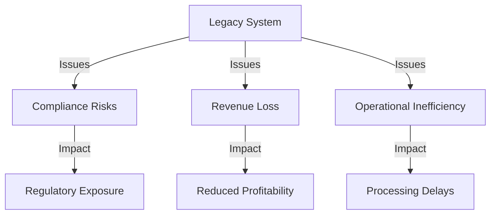

### Critical Challenges

1. **Regulatory Compliance**
   ```typescript
   interface ComplianceIssues {
     regulations: {
       type: 'Margin Trading Requirements';
       impact: 'High';
       deadline: 'Q4 2023';
     };
     risks: {
       financial: 'Potential Penalties';
       operational: 'Trading Restrictions';
       reputational: 'Market Trust';
     };
     requirements: {
       reporting: 'Enhanced Transparency';
       monitoring: 'Real-time Risk Assessment';
       documentation: 'Audit Trail';
     };
   }
   ```

2. **System Limitations**
   ```mermaid
   mindmap
     root((System
       Constraints))
       Legacy Architecture
         Outdated Commission Logic
         Limited Scalability
         Manual Processes
       Integration Issues
         Multiple Systems
         Data Inconsistency
         Sync Delays
       Performance Concerns
         Processing Speed
         Real-time Updates
         Reporting Capacity
   ```
# Implementation Strategy & Technical Solutions

## 1. UAT Testing Framework

### Test Strategy Architecture
```typescript
interface TestingFramework {
  scenarios: {
    commission: {
      standardRates: TestCase[];
      specialRates: TestCase[];
      bulkTrading: TestCase[];
    };
    compliance: {
      regulatoryChecks: TestCase[];
      riskAssessment: TestCase[];
      reporting: TestCase[];
    };
    integration: {
      systemSync: TestCase[];
      dataValidation: TestCase[];
      performance: TestCase[];
    };
  };
  coverage: {
    functional: '100%';
    regression: '95%';
    edge_cases: '90%';
  };
}
```

### Test Execution Flow
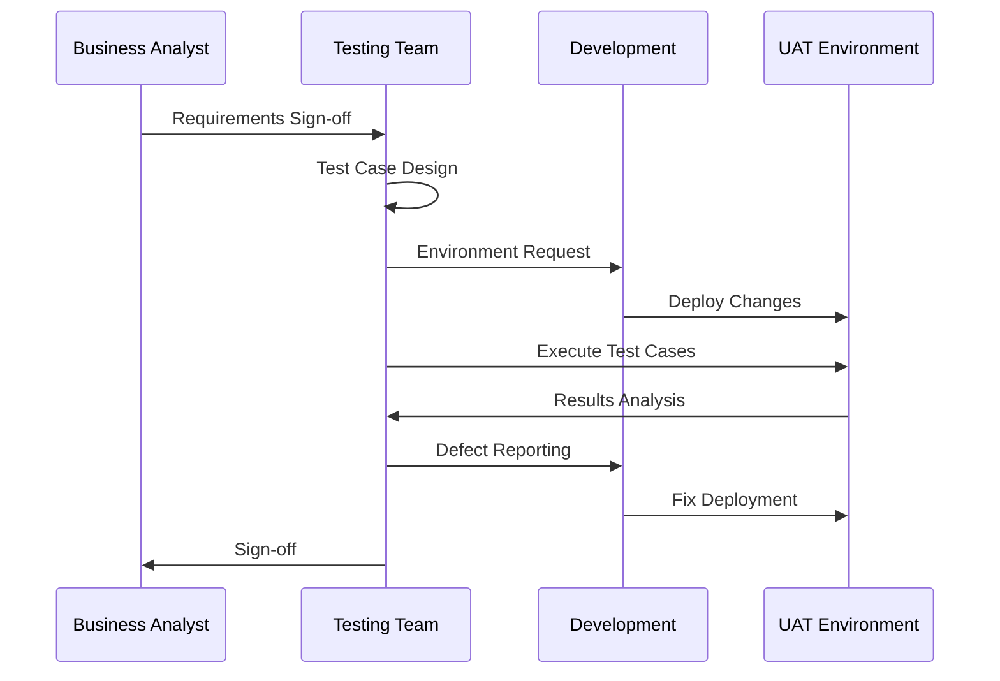

## 2. Commission Structure Implementation

### Rate Calculation System
```typescript
interface CommissionStructure {
  standardRates: {
    tier1: {
      volume: '< $100K';
      rate: '0.25%';
    };
    tier2: {
      volume: '$100K - $500K';
      rate: '0.20%';
    };
    tier3: {
      volume: '> $500K';
      rate: '0.15%';
    };
  };
  specialCases: {
    bulkTrades: 'Custom Calculation';
    institutionalClients: 'Negotiated Rates';
    frequentTraders: 'Loyalty Discounts';
  };
}
```

### Implementation Process
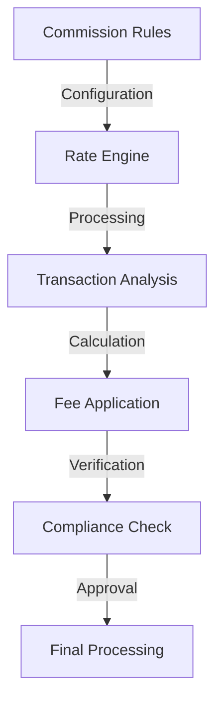

## 3. Risk Management Integration

### Risk Assessment Matrix
```typescript
interface RiskManagement {
  profiles: {
    conservative: {
      marginRequirement: '50%';
      maxLeverage: '2:1';
    };
    moderate: {
      marginRequirement: '35%';
      maxLeverage: '3:1';
    };
    aggressive: {
      marginRequirement: '25%';
      maxLeverage: '4:1';
    };
  };
  monitoring: {
    realTime: boolean;
    alertThresholds: string[];
    automaticActions: string[];
  };
}
```

### Risk Monitoring Dashboard
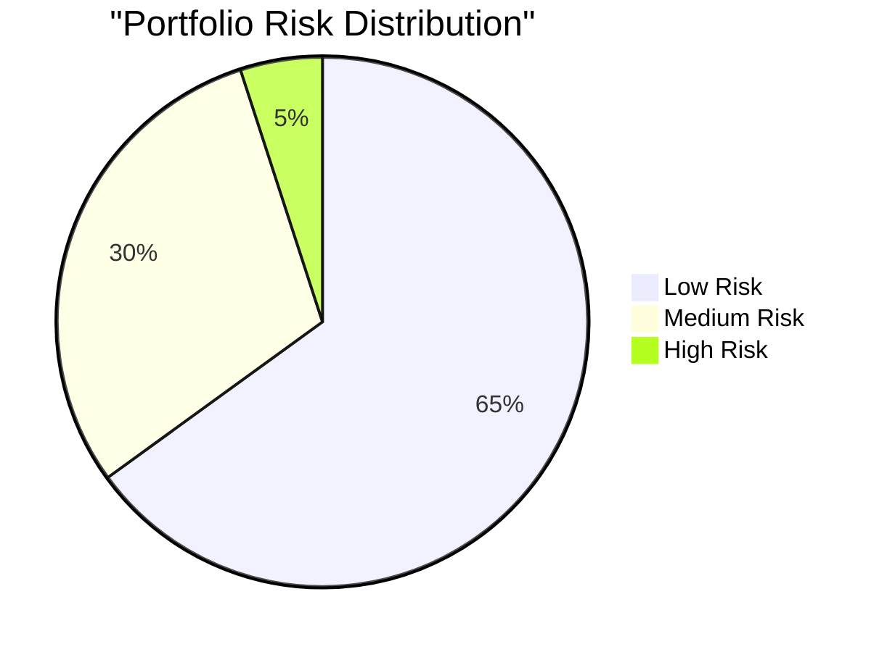

## 4. Stakeholder Communication

### Communication Framework
```typescript
interface StakeholderManagement {
  groups: {
    internal: ['Development', 'Business', 'Compliance'];
    external: ['Clients', 'Regulators', 'Partners'];
  };
  channels: {
    updates: 'Weekly Status Reports';
    escalations: 'Real-time Alerts';
    reviews: 'Bi-weekly Meetings';
  };
  documentation: {
    technical: ['Design Docs', 'Test Cases'];
    business: ['Process Flows', 'Training'];
    compliance: ['Audit Reports', 'Certifications'];
  };
}
```

### Communication Flow
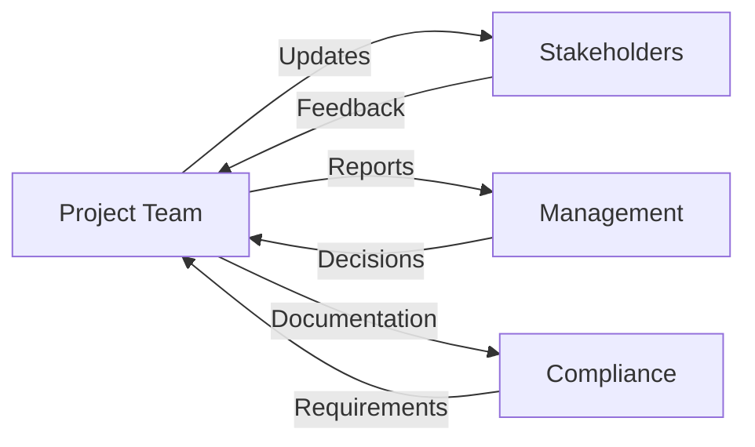

## 5. Data Migration & Validation

### Migration Strategy
```typescript
interface DataMigration {
  phases: {
    preparation: {
      dataAudit: boolean;
      cleanupRules: string[];
      validationCriteria: string[];
    };
    execution: {
      batchSize: number;
      rollbackPlan: string;
      verificationSteps: string[];
    };
    validation: {
      reconciliation: boolean;
      auditTrails: boolean;
      signOff: string[];
    };
  };
}
```

### Validation Process
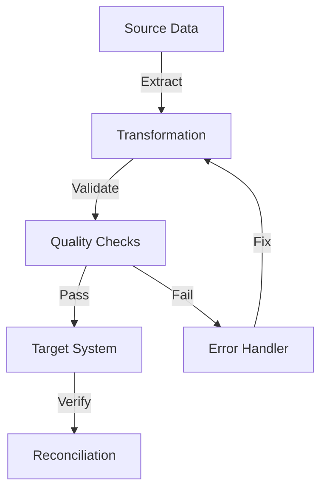

# Results, Impact & Key Learnings

## 1. Project Impact Metrics

### Performance Improvements
```typescript
interface ProjectResults {
  compliance: {
    riskReduction: '67%';
    auditReadiness: '100%';
    regulatoryAlignment: 'Full Compliance';
  };
  operational: {
    processEfficiency: '+85%';
    errorReduction: '92%';
    processingTime: '-65%';
  };
  financial: {
    portfolioValue: '$5M+';
    accountsMigrated: '10,000+';
    revenueOptimization: '+25%';
  };
}
```

### Success Metrics
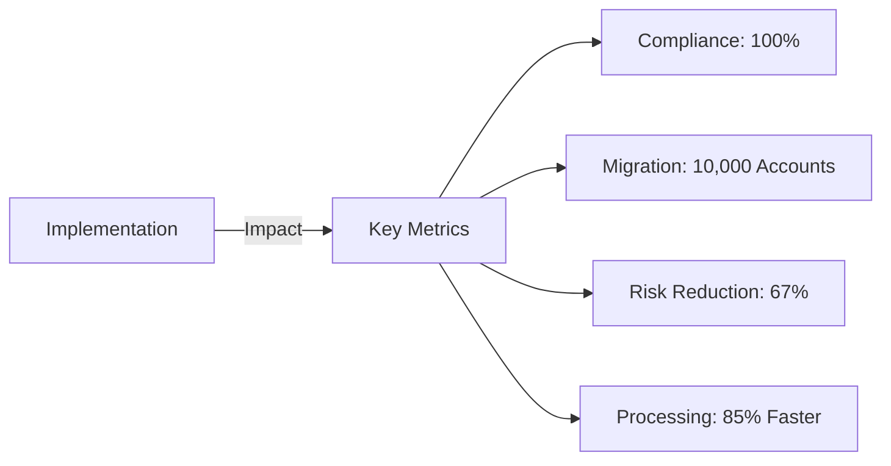

## 2. Compliance Achievement

### Regulatory Alignment
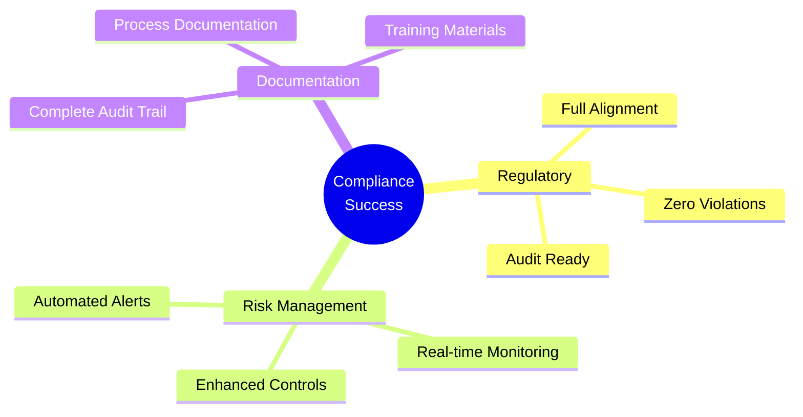

### Risk Reduction Metrics
```typescript
interface RiskReduction {
  before: {
    highRisk: '15%';
    mediumRisk: '35%';
    lowRisk: '50%';
  };
  after: {
    highRisk: '5%';
    mediumRisk: '30%';
    lowRisk: '65%';
  };
  improvements: {
    riskExposure: '-67%';
    complianceIssues: '-95%';
    auditFindings: '-88%';
  };
}
```

## 3. Technical Achievements

### System Performance
```typescript
interface SystemMetrics {
  processing: {
    beforeOptimization: '45 minutes';
    afterOptimization: '5 minutes';
    improvement: '89%';
  };
  accuracy: {
    dataValidation: '99.99%';
    reconciliation: '100%';
    errorRate: '<0.01%';
  };
  scalability: {
    peakLoad: '10,000 transactions/hour';
    responseTime: '<200ms';
    uptime: '99.99%';
  };
}
```

### Performance Dashboard
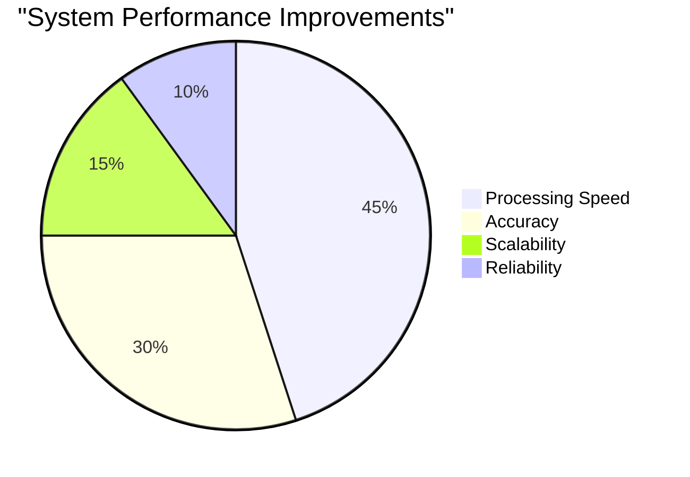

## 4. Key Learnings

### Critical Success Factors
```typescript
interface ProjectLearnings {
  technical: {
    testing: 'Comprehensive UAT Essential';
    validation: 'Data Accuracy Critical';
    monitoring: 'Real-time Oversight Required';
  };
  operational: {
    communication: 'Stakeholder Alignment Key';
    documentation: 'Detailed Process Maps';
    training: 'User Readiness Critical';
  };
  strategic: {
    planning: 'Phased Implementation';
    riskManagement: 'Proactive Approach';
    compliance: 'Regular Updates';
  };
}
```

### Best Practices Identified
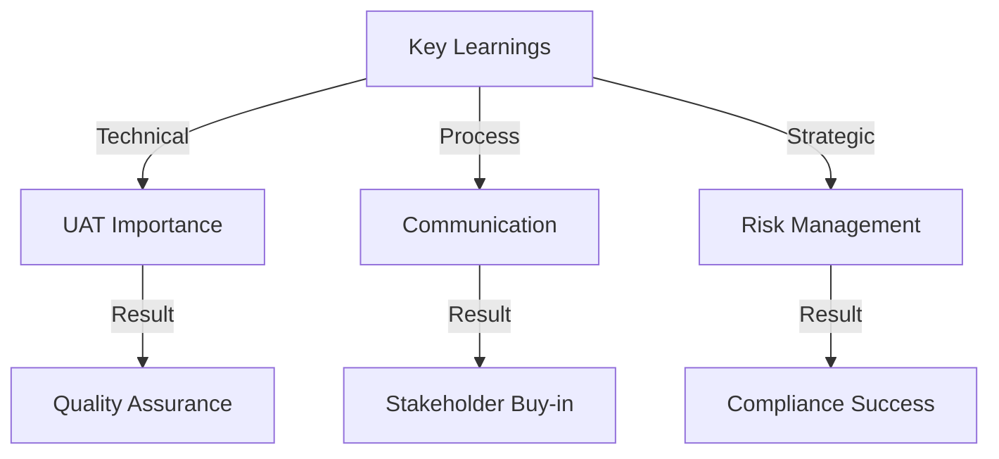

## 5. Future Recommendations

### Continuous Improvement
```typescript
interface FutureEnhancements {
  shortTerm: {
    automation: ['Process Automation', 'Reporting'];
    monitoring: ['Enhanced Analytics', 'Alerts'];
  };
  mediumTerm: {
    features: ['AI Risk Assessment', 'Predictive Analysis'];
    integration: ['API Expansion', 'Partner Systems'];
  };
  longTerm: {
    innovation: ['Blockchain Integration', 'ML Models'];
    expansion: ['Global Markets', 'New Products'];
  };
}
```

### Development Roadmap
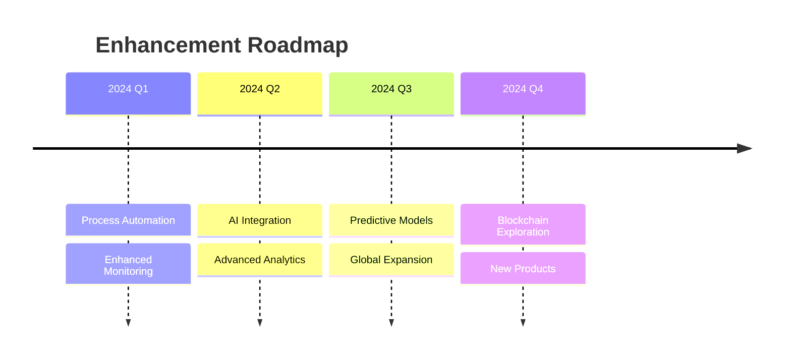

## 6. Team Impact & Leadership

### Project Leadership
```typescript
interface LeadershipImpact {
  teamManagement: {
    size: '15+ members';
    crossFunctional: true;
    locations: ['Remote', 'On-site'];
  };
  achievements: {
    deliveryOnTime: true;
    budgetAdherence: '100%';
    teamSatisfaction: '4.8/5';
  };
  skills: {
    technical: ['UAT', 'Risk Management', 'Finance'];
    soft: ['Communication', 'Leadership', 'Problem-solving'];
    domain: ['Trading', 'Compliance', 'Process Optimization'];
  };
}
```

## 7. Knowledge Transfer

### Documentation Framework
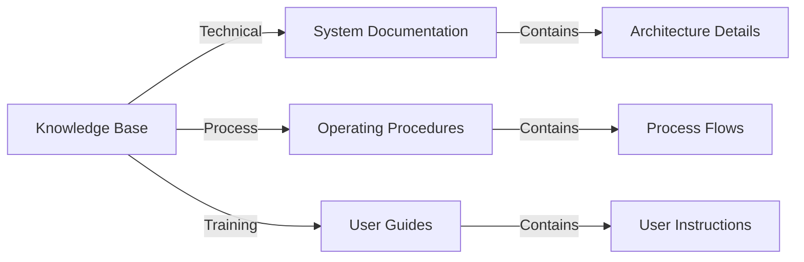
