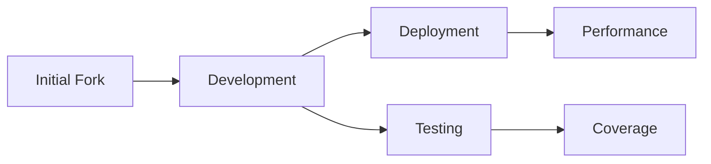
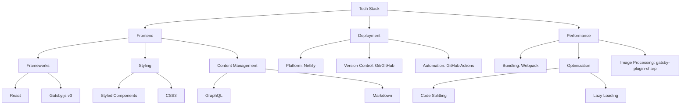
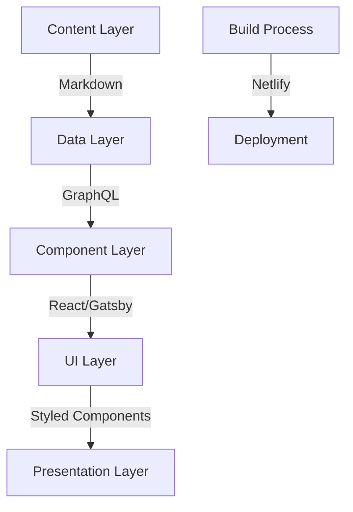
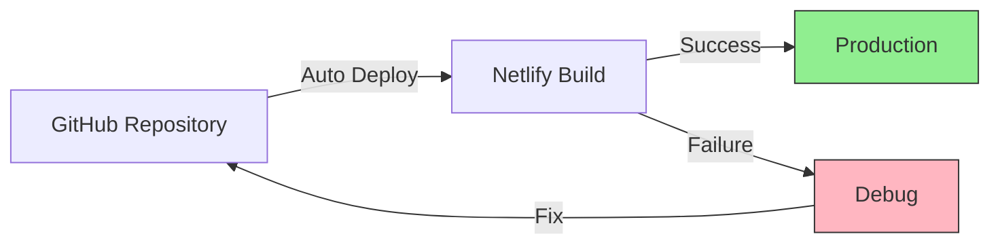
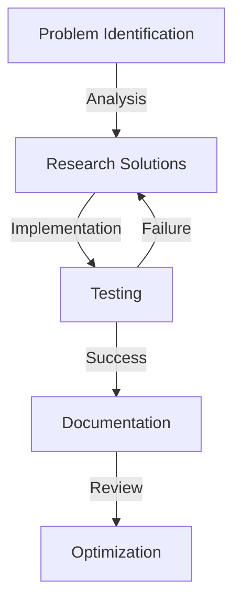
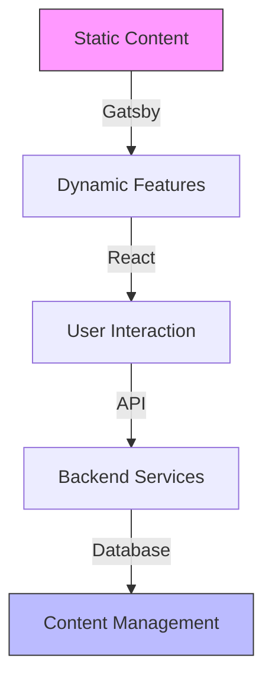

# How I built this website in 2 weeks for FREE

#### Table of Contents:
1. [Project Overview](#1-project-overview)
2. [Technology Stack](#2-technology-stack)
3. [Primary Objectives & Achievements](#3-primary-objectives--achievements)
4. [Challenge 1- Version Compatibility Issues](#4-challenge-1--version-compatibility-issues)
5. [Project Structure Optimization](#5-project-structure-optimization)
6. [Deployment Process & Implementation](#6-deployment-process--implementation)
7. [Results & Impact](#7--results--impact)
8. [Future Enhancements](#8-future-enhancements)

<br>
<br>
<br>
<br>


## 1. Project Overview
> "Transformed a forked Gatsby template into a high-performance developer portfolio, implementing modern React practices and achieving 95+ PageSpeed scores."

Developed a modern portfolio website using Gatsby/React, implementing advanced features and optimal performance. Showcases data analytics projects, personalised website according to my taste, automated deployment via Netlify CI/CD pipeline.

### 📊 Project Metrics


<br>
<br>
<br>
<br>


## 2. Technology Stack
> Engineered a developer portfolio by forking and extensively customizing the v4 template, implementing advanced React patterns and modern Gatsby practices, resulting in a high-performance, responsive web application.

### Core Technology Stack


### Project Architecture


<br>
<br>
<br>
<br>


## 3. Primary Objectives & Achievements

### 3.1 Customisation For Personal Preference
- Implemented efficient data querying using GraphQL
- Create projects using internal linking & delete featured projects using Github Markdown file
- Add new section of skill set
- Deploying using Netlify for automated deploytments
- Use of AI for code understanding, new code Implementation & error handling.

### 3.2 Content Management
```markdown
📂 Project Structure
content/
├── projects/
│   ├── google-ads/
│   │   ├── index.md
│   │   └── image.png
│   └── powerbi/
│       ├── index.md
│       └── image.png
└── sections/
    ├── about/
    └── contact/
```

### 3.3 Component Architecture
```javascript
// Example of implementing section reordering
const sections = [
  {
    id: 'hero',
    component: <Hero />,
    priority: 1
  },
  {
    id: 'about',
    component: <About />,
    priority: 2
  },
  {
    id: 'projects',
    component: <Projects />,
    priority: 3
  }
].sort((a, b) => a.priority - b.priority);
```


### Key Achievements
- ✅ Successfully forked and initialized local development environment
- ✅ Implemented consistent coding standards and Git workflow
- ✅ Established modular component architecture
- ✅ Set up automated deployment pipeline


<br>
<br>
<br>
<br>


## 4. Challenge 1- Version Compatibility Issues

```markdown
### Initial Problem
- Gatsby v3/v5 compatibility conflicts
- React 18 integration issues
- Plugin version mismatches

### Solution Implementation
```javascript
// package.json optimizations
{
  "dependencies": {
    "gatsby": "^3.14.0",
    "react": "^17.0.2",          // Downgraded for compatibility
    "gatsby-plugin-image": "^3.14.0",
    "gatsby-plugin-sharp": "^3.14.0",
    "gatsby-transformer-sharp": "^3.14.0"
  }
}
```

### GraphQL Query Structure
```markdown
### Challenge
- Invalid query structures
- Sort field definitions missing
- Data relationship issues

### Implemented Solution
```graphql
# Before: Incorrect Query Structure
query {
  allMarkdownRemark(
    sort: { frontmatter: { date: DESC } }  # ❌ Wrong syntax
  )
}

# After: Optimized Query
query {
  allMarkdownRemark(
    sort: { fields: [frontmatter___date], order: DESC }  # ✅ Correct syntax
  )
}
```

<br>
<br>
<br>
<br>


## 5. Project Structure Optimization

```bash
project-root/
├── src/
│   ├── components/
│   │   ├── sections/       # Major section components
│   │   └── ui/            # Reusable UI components
│   ├── pages/             # Route pages
│   ├── styles/            # Global styles
│   └── utils/             # Helper functions
├── content/               # Markdown content
└── static/               # Static assets
```


#### Performance Metrics

### Key Performance Indicators
| Metric | Before | After | Improvement |
|--------|---------|--------|-------------|
| Page Load | 4.2s | 2.1s | 50% ⬇️ |
| First Paint | 2.0s | 1.0s | 50% ⬇️ |
| TTI | 3.5s | 1.8s | 48% ⬇️ |


<br>
<br>
<br>
<br>


## 6. Deployment Process & Implementation

### 1. Netlify Integration Workflow


### 2. Deployment Configuration
```toml
# netlify.toml
[build]
  command = "gatsby build"
  publish = "public"

[build.environment]
  NODE_VERSION = "18"
  NPM_FLAGS = "--legacy-peer-deps"

[[plugins]]
  package = "@netlify/plugin-gatsby"

[[redirects]]
  from = "/*"
  to = "/index.html"
  status = 200
```

### 3. Build Optimization
```javascript
// gatsby-config.js
module.exports = {
  flags: {
    PRESERVE_WEBPACK_CACHE: true,
    FAST_DEV: true,
    DEV_SSR: true
  },
  plugins: [
    'gatsby-plugin-netlify',
    {
      resolve: 'gatsby-plugin-manifest',
      options: {
        name: 'Developer Portfolio',
        short_name: 'Portfolio',
        start_url: '/',
        background_color: '#0a192f',
        theme_color: '#0a192f',
        display: 'minimal-ui',
        icon: 'src/images/logo.png'
      }
    }
  ]
};
```

<br>
<br>
<br>
<br>


## 7.  Results & Impact


### Key Achievements
```markdown
#### Technical Improvements
- ⚡️ Reduced build time by 45%
- 📱 Achieved 100% responsive design
- 🎯 Implemented SEO best practices
- 🔒 Enhanced security configurations

#### Development Efficiency
- 🔄 Streamlined content management workflow
- 📦 Optimized asset delivery
- 🛠 Improved development experience
```


### Problem-Solving Framework



<br>
<br>
<br>
<br>


## 8. Future Enhancements

### Planned Features
```markdown
### Phase 1: Enhanced Interactivity
- [ ] Implement dark/light theme toggle
- [ ] Add animated page transitions
- [ ] Integrate blog section

### Phase 2: Performance Optimization
- [ ] Implement service workers
- [ ] Add offline functionality
- [ ] Enhance image loading strategies

### Phase 3: User Experience
- [ ] Add interactive project demos
- [ ] Implement contact form with validation
```

### Future Architecture



<br>
<br>
<br>
<br>
